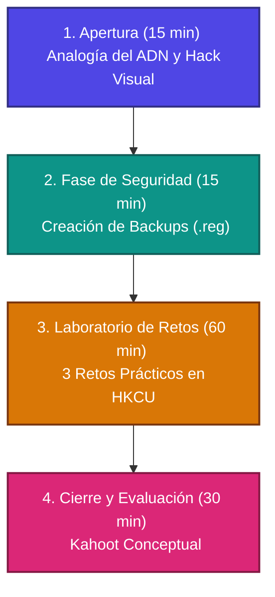

# Plan de Clase: El Núcleo de la Configuración (Registro de Windows)
**Materia:** Laboratorio de Sistemas Operativos (4to Año - Escuela Técnica)  
**Duración:** 2 horas (120 minutos)

> [!NOTE]  
> Este plan está diseñado bajo un enfoque de **aprendizaje activo y gamificado**. Su objetivo es transformar una temática tradicionalmente abstracta y temida en un taller de experimentación técnica seguro y estimulante.

---

## 📋 Resumen Estructural



---

## 🛠️ Configuración del Entorno Seguro: Gestión de Copias de Respaldo

Para garantizar la estabilidad del sistema sin necesidad de crear usuarios adicionales, la práctica se basará en la **disciplina del respaldo técnico**. Los alumnos aprenderán el concepto de "Colmena" (*Hive*) y a realizar copias de seguridad de ramas específicas antes de aplicar cambios.

### 🗃️ ¿Qué es una Colmena (Hive) en el Registro?
El registro de Windows no es un único archivo grande; está dividido en componentes lógicos llamados **Colmenas** (*Hives*). Cada colmena es una estructura jerárquica de claves, subclaves y valores que se almacena en un archivo binario físico en el disco duro.

*   **HKCU (HKEY_CURRENT_USER):** Su archivo físico es `NTUSER.DAT`, ubicado en la raíz del directorio de perfil del usuario (ej. `C:\Users\NombreUsuario\NTUSER.DAT`). Se carga dinámicamente cuando el usuario inicia sesión.
*   **HKLM (HKEY_LOCAL_MACHINE):** Sus archivos físicos están en `C:\Windows\System32\config\` (archivos llamados `SYSTEM`, `SOFTWARE`, `SAM`, `SECURITY` y `DEFAULT`).

---

### ➕ Guía Técnica: Métodos de Respaldo y Restauración

Antes de cualquier modificación, los alumnos deben dominar el respaldo en dos niveles:

## ⏱️ Cronograma Detallado de la Clase

### 1. Apertura: El Gancho y la Analogía del ADN (15 minutos)
*   **La Analogía:** Se explica a los alumnos que la interfaz gráfica (configuración clásica) es como la "piel" del sistema operativo, mientras que el **Registro** es su **código genético (ADN)**. Modificar el Registro es hacer "terapia génica" a la PC: un pequeño cambio en el código cambia el comportamiento físico de manera radical.
*   **Demostración en Vivo (El "Hack" Visual):** 
    1. El docente abre el menú de Windows mostrando la velocidad de animación por defecto.
    2. Abre `regedit`, navega a `HKEY_CURRENT_USER\Control Panel\Desktop` y muestra la clave `MenuShowDelay` (cuyo valor por defecto es 400 milisegundos).
    3. Cambia el valor a `20` y reinicia la sesión (o el proceso *explorer.exe*).
    4. Muestra la respuesta inmediata y ultra veloz del menú. ¡La PC vuela sin actualizar hardware!


### 2. Fase de Seguridad: La Red de Protección (15 minutos)
Antes de tocar cualquier valor, los alumnos aprenden la regla de oro del administrador de sistemas: **"El que no respalda, no sobrevive"**.
*   **Procedimiento Técnico:**
    1. Aprender a abrir el editor ejecutando `regedit` (con teclas `Win + R`).
    2. Navegar a una clave de prueba.
    3. Hacer clic derecho en la clave o carpeta contenedora -> **Exportar**.
    4. Guardar el archivo como `backup_inicial.reg` en el escritorio del usuario actual.
    5. Explicar que el archivo generado es un script de texto plano. Si algo falla, basta con hacer doble clic sobre él para restaurar los valores originales.

---

### 3. El Laboratorio de Retos (60 minutos)

#### Desmitificación: "El Registro es un Disco" (PowerShell)
En lugar de abrir regedit de entrada, conecta esta clase con la terminal (CLI). 
En PowerShell, el registro se puede navegar exactamente como si fuera un disco rígido (C: o D:).

```powershell
cd HKCU:\
dir
cd .\Software\Microsoft\Windows\CurrentVersion\
dir
```
¡El registro tiene carpetas (claves) y archivos (valores)! Esto desmitifica la base de datos jerárquica y lo convierte en un concepto familiar (sistemas de archivos).

#### 2. FlashCards
#### 3. Kahoot

---

## 📈 Criterios de Evaluación Técnica
Para aprobar la práctica, los estudiantes deberán registrar en sus carpetas o portafolios digitales:
* El archivo `.reg` exportado como respaldo del Reto 1.
* Captura de pantalla de acceder al registro desde powershell.
* Explicación escrita con sus palabras de por qué la clave `Run` es crítica para la ciberseguridad defensiva (Reto 3).
