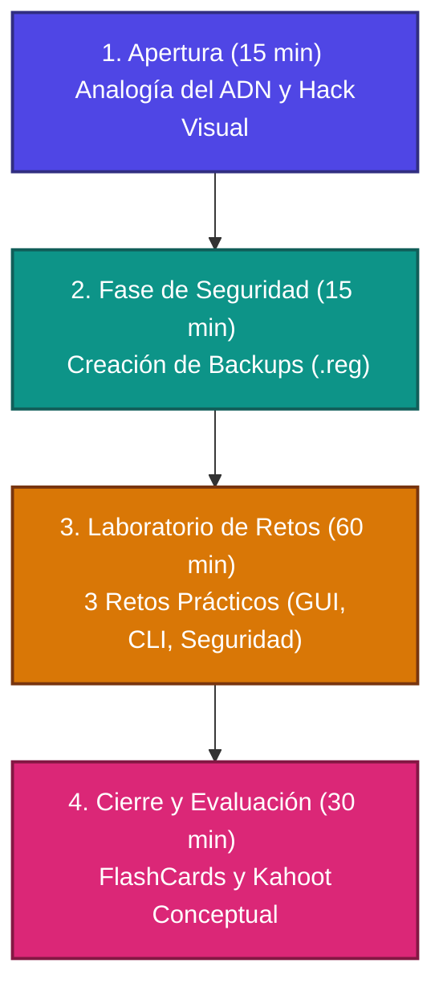

# Plan de Clase: El Núcleo de la Configuración (Registro de Windows) - v1.1

**Materia:** Laboratorio de Sistemas Operativos (4to Año - Escuela Técnica)  
**Duración:** 2 horas (120 minutos)

> [!NOTE]  
> Este plan está diseñado bajo un enfoque de **aprendizaje activo y gamificado**. Su objetivo es transformar una temática tradicionalmente abstracta y temida en un taller de experimentación técnica seguro y estimulante.

---

## 📋 Resumen Estructural



---

## 🛠️ Configuración del Entorno Seguro: Gestión de Copias de Respaldo

Para garantizar la estabilidad del sistema sin necesidad de crear usuarios adicionales, la práctica se basará en la **disciplina del respaldo técnico**. Los alumnos aprenderán el concepto de "Colmena" (*Hive*) y a realizar copias de seguridad de ramas específicas antes de aplicar cambios.

### 🗃️ ¿Qué es una Colmena (Hive) en el Registro?

El registro de Windows no es un único archivo grande; está dividido en componentes lógicos llamados **Colmenas** (*Hives*). Cada colmena es una estructura jerárquica de claves, subclaves y valores que se almacena en un archivo binario físico en el disco duro.

* **HKCU (HKEY_CURRENT_USER):** Su archivo físico es `NTUSER.DAT`, ubicado en la raíz del directorio de perfil del usuario (ej. `C:\Users\NombreUsuario\NTUSER.DAT`). Se carga dinámicamente cuando el usuario inicia sesión.
* **HKLM (HKEY_LOCAL_MACHINE):** Sus archivos físicos están en `C:\Windows\System32\config\` (archivos llamados `SYSTEM`, `SOFTWARE`, `SAM`, `SECURITY` y `DEFAULT`).

---

### ➕ Guía Técnica: Métodos de Respaldo y Restauración

Antes de cualquier modificación, los alumnos deben dominar el respaldo en dos niveles:

#### 🖥️ Nivel 1: Respaldo por Interfaz Gráfica (regedit)

1. Ejecutar `regedit` (presionar `Win + R`, escribir `regedit` y presionar Enter).
2. Navegar hasta la clave o subclave que se desea respaldar (ej. `HKEY_CURRENT_USER\Control Panel\Desktop`).
3. Hacer clic derecho sobre la clave -> Seleccionar **Exportar**.
4. En el cuadro de diálogo, elegir como nombre `backup_desktop.reg` y guardarlo en una carpeta accesible (ej. Escritorio). Asegurarse de que el intervalo de exportación esté seleccionado como *"Rama seleccionada"*.
5. **Restauración:** Si ocurre un error, basta con hacer doble clic sobre el archivo `.reg` guardado y confirmar la fusión de registros, o bien ir a **Archivo > Importar** dentro de `regedit` y seleccionar el archivo de respaldo.

#### 🐚 Nivel 2: Respaldo por Consola (CLI / PowerShell / CMD)

Para tareas de automatización o entornos sin GUI, los comandos equivalentes son:

* **Exportar:**

  ```powershell
  reg export "HKCU\Control Panel\Desktop" "$HOME\Desktop\backup_desktop.reg"
  ```

* **Restaurar/Importar:**

  ```powershell
  reg import "$HOME\Desktop\backup_desktop.reg"
  ```

> [!WARNING]  
> Modificar o eliminar claves del registro sin un respaldo previo puede inducir una **Mutación Dañina** en el sistema operativo, lo que puede provocar inestabilidad o un fallo catastrófico (pantalla azul - BSOD).

---

## ⏱️ Cronograma Detallado de la Clase

### 1. Apertura: El Gancho y la Analogía del ADN (15 minutos)

* **La Analogía:** Se explica a los alumnos que la interfaz gráfica (configuración clásica) es como la "piel" del sistema operativo, mientras que el **Registro** es su **código genético (ADN)**. Modificar el Registro es hacer "terapia génica" a la PC: un pequeño cambio en el código cambia el comportamiento físico de manera radical.
  * **ADN del Sistema:** Base de datos completa de configuraciones.
  * **Cromosomas:** Colmenas (*Hives* - HKLM, HKCU, etc.).
  * **Genes:** Claves y Subclaves.
  * **Bases Nitrogenadas (A, T, C, G):** Valores y tipos de datos (DWORD, SZ, etc.).
  * **Vector de Entrega:** Archivo `.reg` que introduce una modificación genética controlada.
* **Demostración en Vivo (El "Hack" Visual):**
    1. El docente abre el menú de Windows mostrando la velocidad de animación por defecto.
    2. Abre `regedit`, navega a `HKEY_CURRENT_USER\Control Panel\Desktop` y muestra la clave `MenuShowDelay` (cuyo valor por defecto es 400 milisegundos).
    3. Cambia el valor a `20` y reinicia la sesión (o el proceso *explorer.exe* desde PowerShell).
    4. Muestra la respuesta inmediata y ultra veloz del menú. ¡La PC vuela sin actualizar hardware!

### 2. Fase de Seguridad: La Red de Protección (15 minutos)

* Antes de operar, se realiza el laboratorio de respaldo obligatorio. Cada alumno crea el archivo `backup_inicial.reg` de su sección `Control Panel\Desktop`.
* Se inspecciona el archivo `.reg` con el Bloc de notas para demostrar que es texto plano estructurado que instruye a Windows a añadir o cambiar llaves.

### 3. El Laboratorio de Retos (60 minutos)

#### Reto 1: Terapia Génica (Optimización de Rendimiento en Equipos Limitados)

* **Objetivo:** Reducir la sobrecarga gráfica en equipos de bajos recursos modificando directamente el ADN del sistema.
* **Paso 1 (Aceleración de Menús):** Cambiar `MenuShowDelay` a `20` en `HKCU\Control Panel\Desktop`.
* **Paso 2 (Desactivar Suavizado de Fuentes):** Navegar a la misma ruta y localizar `FontSmoothing` (cuyo valor por defecto es `2` - suavizado activo). Modificar su valor a `0` para optimizar el procesamiento de renderizado tipográfico.
* **Verificación:** Ejecutar `sysdm.cpl` (Propiedades del Sistema), ir a *Opciones avanzadas > Rendimiento > Configuración* y observar cómo el sistema refleja visualmente estos cambios.

#### Reto 2: Navegación del ADN sin GUI ("El Registro es un Disco")

* **Objetivo:** Conectar la clase con la interfaz de línea de comandos (CLI) utilizando PowerShell para entender la estructura jerárquica del registro.
* **Instrucciones:** Abrir PowerShell y navegar el registro como si fuera un sistema de archivos tradicional.
* **Comandos a ejecutar:**

    ```powershell
    # Cambiar de directorio a la colmena del usuario actual
    cd HKCU:\
    # Listar carpetas/claves principales
    dir
    # Navegar al historial de versiones de Windows
    cd .\Software\Microsoft\Windows\CurrentVersion\
    # Listar los elementos
    dir
    # Consultar las propiedades y valores específicos
    Get-ItemProperty -Path "HKCU:\Control Panel\Desktop" -Name "MenuShowDelay"
    ```

* *Explicación conceptual:* Al igual que un disco tiene directorios y archivos, el registro contiene **claves (directorios)** y **valores (archivos)**.

#### Reto 3: Persistencia y Ciberseguridad Defensiva (La Clave Run)

* **Objetivo:** Comprender cómo se configuran las aplicaciones de inicio automático y por qué este punto es crítico en seguridad informática (persistencia de malware).
* **Paso 1:** Navegar en PowerShell a la ruta de aplicaciones de inicio automático del usuario:

    ```powershell
    cd "HKCU:\Software\Microsoft\Windows\CurrentVersion\Run"
    dir
    ```

* **Paso 2 (Simulación Defensiva):** Analizar qué programas arrancan automáticamente. Crear un valor de prueba inofensivo utilizando PowerShell para simular cómo un software se añade al inicio:

    ```powershell
    New-ItemProperty -Path "HKCU:\Software\Microsoft\Windows\CurrentVersion\Run" -Name "SimulacionSegura" -Value "C:\Windows\System32\notepad.exe" -PropertyType "String"
    ```

* **Paso 3 (Limpieza):** Eliminar el valor creado para mantener el sistema limpio:

    ```powershell
    Remove-ItemProperty -Path "HKCU:\Software\Microsoft\Windows\CurrentVersion\Run" -Name "SimulacionSegura"
    ```

* *Reflexión de Ciberseguridad:* Las claves `Run` (tanto en HKCU como en HKLM) son de las ubicaciones más vigiladas. El malware suele alojarse aquí para activarse tras cada inicio de sesión (persistencia).

---

## 📈 Criterios de Evaluación Técnica

Para aprobar la práctica, los estudiantes deberán registrar en sus carpetas o portafolios digitales:

1. El archivo `.reg` exportado como respaldo del Reto 1 (`backup_desktop.reg`).
2. Captura de pantalla de la navegación del registro en PowerShell mostrando la ruta `HKCU:\Software\Microsoft\Windows\CurrentVersion\Run`.
3. Explicación escrita con sus palabras de por qué la clave `Run` es crítica para la ciberseguridad defensiva (analizando el concepto de persistencia de amenazas).

---

## 📚 Anexo Técnico: Estructura Completa del Registro (Para el Docente)

Este anexo sirve como guía rápida de referencia para responder preguntas frecuentes sobre la estructura del registro que no se detallan en el cuerpo principal de la clase.

### 🔑 Claves Raíz Adicionales (HKEYs)

* **`HKEY_CLASSES_ROOT` (HKCR):** Gestiona las asociaciones de archivos (ej. qué programa abre un archivo `.txt`) y la configuración de objetos OLE/COM. Es una vista combinada de `HKLM\Software\Classes` y `HKCU\Software\Classes`.
* **`HKEY_USERS` (HKU):** Contiene la configuración individual de todos los perfiles de usuario cargados en la máquina. Cada perfil está identificado por su SID (Security Identifier). `HKCU` es un enlace dinámico a la subclave del usuario actual dentro de `HKU`.
* **`HKEY_CURRENT_CONFIG` (HKCC):** Almacena información temporal sobre el perfil de hardware activo en la sesión actual. Es un enlace directo a `HKLM\System\CurrentControlSet\Hardware Profiles\Current`.

### 🗄️ Colmenas Físicas en Disco (`C:\Windows\System32\config\`)

* **`SAM` (Security Accounts Manager):** Base de datos de credenciales locales. Almacena nombres de usuario y las contraseñas encriptadas (hashes).
* **`SECURITY`:** Gestiona las políticas de seguridad del sistema, asignación de derechos de usuario y directivas grupales de red locales.
* **`SOFTWARE`:** Almacena la configuración global de Windows y de todos los programas instalados que aplica a cualquier usuario.
* **`SYSTEM`:** Almacena la base de datos de inicio del sistema, configuración de controladores de dispositivos (drivers) y servicios críticos de Windows. Si este archivo se daña, el sistema sufrirá un fallo catastrófico (BSOD).
* **`DEFAULT`:** Plantilla base de perfil de usuario. Se usa como plantilla inicial para crear el entorno de cualquier usuario nuevo.
* **`HARDWARE` (Volátil):** Se genera en la memoria RAM en cada arranque para mapear los dispositivos físicos (procesador, BIOS, buses). No se almacena en el disco.
