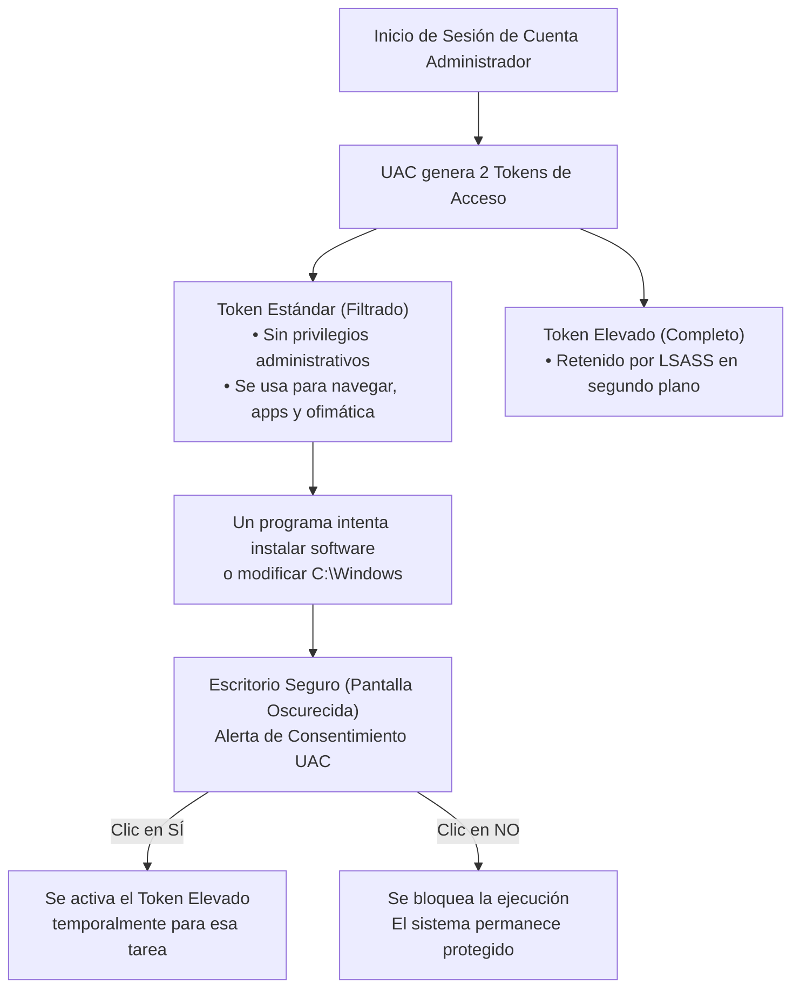
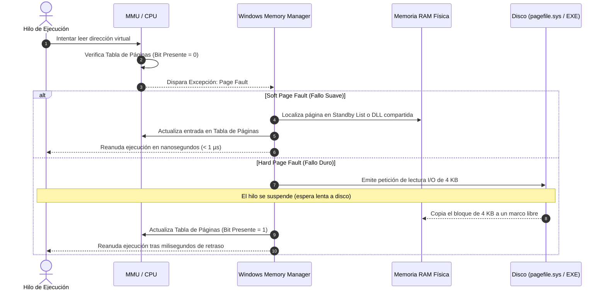

# Compendio Integral de Cátedra: Almacenamiento, Seguridad y Memoria
## Laboratorio de Sistemas Operativos (LSO) — 4.º Año
### Tecnicatura en Informática Personal y Profesional (Res. 3828/09)
### Eje Temático Integrado: Módulo 1 (Almacenamiento), Módulo 2 (Seguridad y Permisos), Módulo 3 (Arquitectura de Memoria)

---

## 🎯 Presentación y Propósito del Compendio
El presente documento constituye el manual unificado de referencia técnica y estudio para el bloque temático fundamental del segundo semestre de **Laboratorio de Sistemas Operativos (LSO)**. Integra de manera exhaustiva, sistemática y articulada todos los conocimientos, comandos de consola (Windows CMD, PowerShell y Linux Bash), diagramas de arquitectura interna y procedimientos diagnósticos desarrollados en:

* **Módulo 1:** Arquitectura de Almacenamiento, Esquemas de Particionado (MBR vs. GPT) y Sistemas de Archivos (NTFS vs. EXT4).
* **Módulo 2:** Seguridad Local, Identidades (SID, Tokens, UAC), Listas de Control de Acceso (NTFS DACL / `icacls`) y Permisos POSIX (`chmod`, `chown`).
* **Módulo 3:** Arquitectura de Memoria Física y Virtual, Jerarquía de Hardware, MMU, Paginación de 4 KB, Fallos de Página (*Page Faults*), `pagefile.sys` y Pools del Kernel.

---

# 📑 ÍNDICE GENERAL

1. [MÓDULO 1: ARQUITECTURA DE ALMACENAMIENTO Y SISTEMAS DE ARCHIVOS](#1-módulo-1-arquitectura-de-almacenamiento-y-sistemas-de-archivos)
   - 1.1. Fundamentos: Capa Física vs. Capa Lógica
   - 1.2. Duelo de Esquemas de Particionado: MBR vs. GPT
   - 1.3. Discos Virtuales en Windows: Formatos VHD y VHDX
   - 1.4. Administración CLI de Almacenamiento en Windows (`diskpart` y PowerShell)
   - 1.5. El Sistema de Archivos NTFS: MFT, Journaling, Clusters y *Slack Space*
   - 1.6. Almacenamiento en Linux: Pseudo-sistema `/dev/`, Dispositivos de Bloque y Caracteres
   - 1.7. Puntos de Montaje y Tabla Persistente `/etc/fstab`
   - 1.8. Matriz Comparativa: NTFS vs. EXT4 vs. FAT32
2. [MÓDULO 2: SEGURIDAD, PERMISOS Y GESTIÓN DE IDENTIDADES](#2-módulo-2-seguridad-permisos-y-gestión-de-identidades)
   - 2.1. Arquitectura de Seguridad en Windows NT: SAM, LSASS y SRM
   - 2.2. Identidades Digitales: SID, RIDs Estándar y Access Tokens
   - 2.3. Gestión de Cuentas y Grupos Locales (CLI y GUI)
   - 2.4. Control de Cuentas de Usuario (UAC): Arquitectura de Token Dividido
   - 2.5. Permisos NTFS y Listas de Control de Acceso (DACL, SACL, ACE)
   - 2.6. Herencia de Permisos y Banderas de Propagación (`icacls` vs. GUI)
   - 2.7. Matriz de Precedencia Estricta de Windows SRM (Deny vs. Allow)
   - 2.8. Toma de Posesión (*Ownership*) y Diagnóstico con "Acceso Efectivo"
   - 2.9. Modelo de Seguridad y Permisos POSIX en Linux
   - 2.10. Matriz Comparativa de Seguridad: Windows NTFS vs. Linux POSIX
3. [MÓDULO 3: ARQUITECTURA Y ADMINISTRACIÓN DE MEMORIA](#3-módulo-3-arquitectura-y-administración-de-memoria)
   - 3.1. La Jerarquía de Memorias en la Computación Moderna
   - 3.2. De la Memoria Real a la Memoria Virtual: "La Ilusión Contigua"
   - 3.3. Unidad de Administración de Memoria (MMU) y Memoria Caché TLB
   - 3.4. Espacio de Direcciones Virtuales (VAS): 32 bits vs. 64 bits y Anillos de Protección
   - 3.5. Mecanismo de Paginación: Páginas Virtuales (4 KB), Marcos Físicos y Tablas de Páginas
   - 3.6. Gestión de Fallos de Página (*Page Faults*): Suaves vs. Duros y el Fenómeno de *Thrashing*
   - 3.7. El Archivo de Paginación `pagefile.sys`: Funcionamiento Real y Mitos Técnicos
   - 3.8. Métricas Clave de Memoria: *Working Set*, *Commit Size* y *Commit Limit*
   - 3.9. Pools de Memoria del Kernel: *Non-Paged Pool* vs. *Paged Pool*
   - 3.10. Auditoría y Diagnóstico Clínico en Windows 11 (Task Manager, Resmon y PowerShell)
4. [SÍNTESIS CLÍNICA Y RESOLUCIÓN DE INCIDENTES EN LABORATORIO](#4-síntesis-clínica-y-resolución-de-incidentes-en-laboratorio)
5. [GLOSARIO TÉCNICO MAESTRO DE CÁTEDRA](#5-glosario-técnico-maestro-de-cátedra)

---

# 1. MÓDULO 1: ARQUITECTURA DE ALMACENAMIENTO Y SISTEMAS DE ARCHIVOS

## 1.1 Fundamentos: Capa Física vs. Capa Lógica
El almacenamiento secundario (discos duros HDD, unidades de estado sólido SATA/NVMe o pendrives USB) representa un espacio lineal continuo de almacenamiento binario persistente. Sin embargo, un sistema operativo no puede escribir archivos directamente sobre un disco sin estructuración previa.

Existen tres capas jerárquicas fundamentales:
1. **Capa de Medio Físico / Sintético:** El hardware físico o disco virtual (VHD/VHDX/IMG) que expone sectores crudos (*raw blocks*).
2. **Capa de Esquema de Particionado:** La división lógica del medio en contenedores independientes reconocibles por el firmware (BIOS o UEFI) y el Kernel (esquemas MBR o GPT).
3. **Capa de Sistema de Archivos:** La estructura de datos interna (metadatos, tablas de asignación, directorios e índices de inodos o MFT) que permite organizar, nombrar, jerarquizar y proteger los archivos y carpetas (NTFS, EXT4, FAT32).

---

## 1.2 Duelo de Esquemas de Particionado: MBR vs. GPT

```mermaid
graph TD
    subgraph "MBR (Master Boot Record) - BIOS Heredado"
        MBR_S0["Sector 0 (LBA 0 - 512 bytes)<br>• Bootstrap Code (446 B)<br>• Partition Table (64 B - 4 entradas)<br>• Boot Signature (0x55AA - 2 B)"]
        MBR_PART["Máximo 4 Particiones Primarias<br>(O 3 Primarias + 1 Extendida con Lógicas)"]
        MBR_LIMIT["Direccionamiento LBA de 32 bits<br>Límite Teórico: 2.19 TB (2 TiB)"]
        MBR_FAIL["Sin tolerancia a fallos ni sumas de integridad"]
        MBR_S0 --> MBR_PART --> MBR_LIMIT --> MBR_FAIL
    end

    subgraph "GPT (GUID Partition Table) - Estándar UEFI Moderno"
        GPT_S0["LBA 0: Protective MBR (Previene sobreescritura legada)"]
        GPT_S1["LBA 1: Primary GPT Header + CRC32"]
        GPT_ENTRIES["LBA 2-33: 128 Entradas de Partición (128 bits c/u)"]
        GPT_DATA["Particiones de Datos direccionadas en 64 bits (hasta 9.4 ZB)"]
        GPT_BACKUP["Final del Disco: Backup GPT Header (Redundancia de rescate)"]
        GPT_S0 --> GPT_S1 --> GPT_ENTRIES --> GPT_DATA --> GPT_BACKUP
    end
```



### 1. El Esquema MBR (*Master Boot Record*)
* **Origen:** Creado en 1983 por IBM para PC-DOS 2.0.
* **Ubicación:** Se aloja exclusivamente en los primeros 512 bytes del disco físico (**LBA 0 / Sector 0**).
* **Limitación Matemática de Capacidad (Límite de 2 TB):**  
  MBR utiliza registros de **32 bits** para almacenar el número de sectores lógicos (*Logical Block Addressing* - LBA). Dado que el tamaño estándar de sector es de 512 bytes:
  $$\text{Capacidad Máxima MBR} = 2^{32} \times 512 \text{ bytes} = 4.294.967.296 \times 512 \text{ bytes} = 2.199.023.255.552 \text{ bytes} \approx 2,19 \text{ TB (2 TiB)}$$
  Si se conecta un disco físico de 4 TB o 8 TB e inicializa con MBR, todo el espacio por encima de los 2 TB queda como espacio no asignable e inutilizable.
* **Límite de Particiones:** Su tabla mide exactamente 64 bytes (4 registros de 16 bytes), limitando el disco a **4 particiones primarias**. Para superar esto, se debe sacrificar una primaria y convertirla en partición extendida que aloje unidades lógicas.
* **Punto Único de Fallo:** Posee una única copia en el Sector 0. Si se daña dicho sector físico por desgaste magnético o infección de malware (Bootkit), la tabla de particiones se destruye íntegramente.

### 2. El Estándar GPT (*GUID Partition Table*)
* **Origen:** Introducido como parte de la especificación moderna **UEFI** (*Unified Extensible Firmware Interface*).
* **Direccionamiento de 64 bits:** Permite direccionar hasta $2^{64}$ sectores, lo que equivale a **9,4 Zettabytes (ZB)** ($9,4 \times 10^{21}$ bytes). **En cualquier disco mayor a 2 TB es técnicamente obligatorio utilizar GPT**.
* **Cantidad de Particiones:** En Windows y Linux soporta un mínimo de **128 particiones primarias** sin requerir particiones extendidas ni unidades lógicas.
* **Identificación Unívoca:** Cada partición recibe un identificador global único de 128 bits (**GUID / UUID**), evitando conflictos entre unidades.
* **Redundancia y Tolerancia a Fallos:** Posee un encabezado primario al inicio del disco (LBA 1) y un **encabezado secundario de respaldo (*Backup GPT*)** ubicado en los últimos sectores físicos del disco. Si el encabezado primario sufre corrupción, el firmware UEFI y el SO restauran la tabla automáticamente desde la copia secundaria.
* **Verificación de Integridad:** Incluye sumas de comprobación **CRC32** (*Cyclic Redundancy Check*). Si un byte se corrompe, el sistema detecta el error en el arranque.
* **Protective MBR (LBA 0):** Para evitar que herramientas y sistemas operativos antiguos que no reconocen GPT interpreten el disco como vacío y lo sobrescriban, GPT coloca en el sector 0 un MBR defensivo con una sola partición de tipo `0xEE` que abarca todo el disco.

### 3. Migración en Vivo sin Pérdida de Datos: `mbr2gpt`
Windows 10/11 incluye la herramienta nativa `mbr2gpt.exe` para convertir discos de sistema de MBR a GPT sin formatear:
```cmd
:: 1. Validar que el disco cumpla los requisitos (máximo 3 particiones primarias):
mbr2gpt /validate /disk:0 /allowFullOS

:: 2. Ejecutar la conversión a GPT:
mbr2gpt /convert /disk:0 /allowFullOS
```

---

## 1.3 Discos Virtuales en Windows: Formatos VHD y VHDX
Los discos virtuales son archivos contenedores que el sistema operativo encapsula y monta como si fuesen unidades físicas reales conectadas por bus SATA/NVMe.

| Característica | Formato VHD (*Virtual Hard Disk*) | Formato VHDX (*Hyper-V Virtual Hard Disk*) |
| :--- | :--- | :--- |
| **Capacidad Máxima** | Hasta 2 TB (2048 GB) | Hasta 64 TB |
| **Resistencia a Fallos** | Vulnerable ante cortes repentinos de energía | Posee un registro interno (*Log*) para tolerar apagados abruptos |
| **Alineación de Bloques** | Estándar de 512 bytes | Bloques grandes de 4 KB (óptimo para SSDs modernos) |
| **Compatibilidad** | Windows 7 en adelante / Virtual PC | Windows 8 / Windows Server 2012 en adelante |

### Modos de Asignación de Espacio:
* **Disco Fijo (*Fixed*):** El archivo contenedor reserva todo el espacio físico en el disco anfitrión desde el momento de su creación. Ofrece el máximo rendimiento de lectura/escritura (sin fragmentación), pero consume espacio de forma inmediata.
* **Disco Dinámico / Expandible (*Expandable*):** El archivo se crea con un tamaño inicial ínfimo (pocos KB) y va creciendo en el disco físico únicamente a medida que se escriben datos en su interior, hasta alcanzar el límite máximo especificado. Es el modo predilecto para entornos de laboratorio y netbooks escolares con poco almacenamiento.

---

## 1.4 Administración CLI de Almacenamiento en Windows (`diskpart` y PowerShell)

### Flujo Completo de Aprovisionamiento en `diskpart` (CMD Administrador):
```cmd
diskpart
```
```cmd
:: 1. Crear un disco virtual VHDX dinámico de 1024 MB (o 128 MB en netbooks):
create vdisk file="C:\Temp\DiscoLSO.vhdx" maximum=1024 type=expandable

:: 2. Seleccionar y adjuntar el disco virtual al subsistema de E/S de Windows:
select vdisk file="C:\Temp\DiscoLSO.vhdx"
attach vdisk

:: 3. Inicializar la tabla de particiones en esquema moderno GPT:
convert gpt

:: 4. Crear la partición primaria con un tamaño específico (ej. 500 MB) o total:
create partition primary size=500

:: 5. Formatear la partición en NTFS con volumen etiquetado:
format fs=ntfs quick label="LSO_DATOS"

:: 6. Asignar letra de unidad para acceso en el Explorador de Archivos:
assign letter=Z

:: 7. Listar volúmenes y discos para verificar estado:
list disk
list volume
exit
```

### Operaciones de Montaje y Desmontaje de Unidades Virtuales:
Para desconectar un VHDX sin eliminar el archivo físico:
```cmd
diskpart
select vdisk file="C:\Temp\DiscoLSO.vhdx"
detach vdisk
exit
```
Para volver a montarlo en cualquier momento:
```cmd
diskpart
select vdisk file="C:\Temp\DiscoLSO.vhdx"
attach vdisk
exit
```

### Equivalentes Modernos en PowerShell:
```powershell
# Inspección de discos y particiones montadas
Get-Disk | Format-Table Number, FriendlyName, PartitionStyle, Size
Get-Partition -DriveLetter Z
Get-Volume -DriveLetter Z

# Formateo de volumen directo desde PowerShell
Format-Volume -DriveLetter Z -FileSystem NTFS -NewFileSystemLabel "LSO_PS" -AllocationUnitSize 4096 -Confirm:$false
```

---

## 1.5 El Sistema de Archivos NTFS: MFT, Journaling, Clusters y *Slack Space*

### Desglose Clínico de: `format fs=ntfs quick label="LSO_DATOS"`
* **`format`:** Invoca el formateador lógico de Windows para inicializar estructuras de metadatos.
* **`fs=ntfs` (*New Technology File System*):** Configura la arquitectura NTFS, activando la MFT, el registro de transacciones (*Journaling*) y el soporte de Listas de Control de Acceso (ACLs).
* **`quick`:** Modo rápido. Escribe exclusivamente las estructuras maestras de metadatos (MFT e índices) en pocos segundos, omitiendo el escaneo de sectores defectuosos y el llenado de ceros.
* **`label="..."`:** Asigna la etiqueta amigable que se visualizará en el sistema.

### Estructura Interna de NTFS:
1. **MFT (*Master File Table*):** Es el corazón de NTFS. Una base de datos relacional de metadatos donde **cada archivo o carpeta ocupa al menos un registro de 1024 bytes (1 KB)**. En él se almacenan los atributos estándar, fechas MACB (Modificación, Acceso, Creación, MFT), punteros a los clusters de datos y la DACL de seguridad.
2. **Journaling (Diario de Transacciones - `$LogFile`):** Antes de ejecutar cualquier modificación en la estructura del disco, NTFS anota la transacción pendiente en un diario circular. Si se corta la energía a mitad de escritura, al reiniciar el sistema lee el `$LogFile` y realiza un *rollback* o *roll-forward*, evitando la corrupción del volumen sin requerir chequeos lentos de disco (`chkdsk`).

### Clusters y el Fenómeno de *Slack Space*:
* **Cluster (Unidad de Asignación):** Es el bloque lógico indivisible más pequeño que el sistema de archivos puede asignar a un archivo. En NTFS el tamaño estándar es de **4 KB (4096 bytes)**.
* **Slack Space (Espacio Holgado / Desperdicio Interno):** Diferencia entre el tamaño real del archivo y el espacio físico asignado en disco.
  $$\text{Slack Space} = \text{Tamaño del Cluster} - (\text{Tamaño del Archivo} \pmod{\text{Tamaño del Cluster}})$$
  * *Ejemplo clínico:* Un archivo de configuración que pesa **500 bytes** consume un cluster completo de **4096 bytes**. El espacio restante de **3596 bytes** queda bloqueado e inutilizable (*slack space*).

---

## 1.6 Almacenamiento en Linux: Pseudo-sistema `/dev/`, Dispositivos de Bloque y Caracteres
En Linux rige el principio fundamental de diseño UNIX: **"En Linux, todo se representa como un archivo"**. Los periféricos y componentes de almacenamiento no utilizan letras (`C:`, `D:`), sino nodos de dispositivo especiales creados en el directorio `/dev/`.

### Clasificación de Dispositivos:
* **Dispositivos de Caracteres (`c`):** Transmiten datos byte a byte en flujo secuencial sin búfer aleatorio (ej. consolas `/dev/tty1`, generadores de aleatoriedad `/dev/urandom`, sumideros de datos `/dev/null`).
* **Dispositivos de Bloques (`b`):** Transmiten información en bloques de tamaño fijo (típicamente 512 B o 4 KB) accesibles de forma directa y aleatoria (discos duros, particiones, pendrives).

### Nomenclatura del Kernel para Dispositivos de Bloque:
* `/dev/sda`, `/dev/sdb`: Primer y segundo disco SATA / SCSI / USB tradicional.
* `/dev/sda1`, `/dev/sda2`: Primera y segunda partición física dentro del disco `sda`.
* `/dev/nvme0n1`: Disco SSD de estado sólido bajo protocolo NVMe M.2 (Controlador 0, *Namespace* 1).
* `/dev/nvme0n1p1`: Primera partición del disco NVMe anterior.
* `/dev/loop0`, `/dev/loop1`: Dispositivos virtuales Loopback (archivos de imagen montados como discos de bloque).

---

## 1.7 Puntos de Montaje y Tabla Persistente `/etc/fstab`
A diferencia de Windows, donde cada volumen recibe una letra de unidad (`C:`, `D:`), en Linux existe **un único árbol jerárquico unificado que nace en la raíz `/`**. Para acceder a una partición, esta debe asociarse (*injertarse*) a un directorio vacío denominado **Punto de Montaje** (*Mount Point*).

```bash
# 1. Crear directorio punto de montaje:
sudo mkdir -p /mnt/datos_lso

# 2. Montar la partición (ej. primera partición del segundo disco sdb):
sudo mount /dev/sdb1 /mnt/datos_lso

# 3. Desmontar de forma segura:
sudo umount /mnt/datos_lso
```

### Estructura del Archivo `/etc/fstab` (6 Columnas):
El archivo `/etc/fstab` (*File System Table*) define qué particiones monta el Kernel automáticamente durante el inicio:

```text
# <Dispositivo o UUID>               <Punto Montaje>  <FSType>  <Opciones>         <Dump>  <Pass>
UUID=4f3a2b1c-8e9d-4c3b-a1b2-0123456789ab  /mnt/datos_lso   ext4      defaults,noatime   0       2
```

1. **Dispositivo o UUID:** Identificador unívoco obtenido mediante `sudo blkid`. Es preferible usar UUID porque las letras de unidad (`/dev/sda`, `/dev/sdb`) pueden alterarse si se conectan otros discos.
2. **Punto de Montaje:** Ruta absoluta en el árbol raíz `/` donde se asociará el contenido.
3. **Tipo de Sistema de Archivos (`FSType`):** `ext4`, `vfat`, `ntfs3`, `swap`, etc.
4. **Opciones de Montaje:**
   * `defaults`: Activa el conjunto `rw` (lectura/escritura), `suid`, `dev`, `exec`, `auto`, `nouser`, `async`.
   * `noatime`: Desactiva la actualización de la fecha de acceso cada vez que se lee un archivo, aumentando drásticamente la velocidad de lectura en SSDs.
   * `ro`: Montaje en modo de solo lectura.
5. **Dump:** Parámetro de respaldo para la herramienta `dump` (`0` para deshabilitar).
6. **Pass (Orden de Chequeo `fsck` en el arranque):**
   * `0`: No comprobar errores (utilizado para swap, CD-ROMs o particiones Windows NTFS).
   * `1`: Máxima prioridad. **Reservado exclusivamente para la partición raíz `/`**.
   * `2`: Resto de particiones de datos.

---

## 1.8 Matriz Comparativa: NTFS vs. EXT4 vs. FAT32

| Característica | NTFS (Windows 11) | EXT4 (Linux) | FAT32 (Heredado / Multiplataforma) |
| :--- | :--- | :--- | :--- |
| **Tamaño Máximo de Archivo** | 16 TB (teórico 8 PB) | 16 TB | **4 GB** (Límite estricto) |
| **Tamaño Máximo de Volumen** | Hasta 8 PB | Hasta 1 Exabyte (EB) | 2 TB (o 32 GB en utilidades Windows) |
| **Estructura Central de Metadatos** | **MFT** (Master File Table) | **Tabla de Inodos** y Superbloques | FAT (File Allocation Table) |
| **Tolerancia a Fallos** | **Journaling** (`$LogFile`) | **Journaling** (JBD2) | Sin Journaling (Muy vulnerable) |
| **Seguridad y Permisos** | ACLs nativas (DACL / SACL), SID | Permisos POSIX (`rwx`), ACLs opcionales | **Sin seguridad de permisos nativa** |
| **Sensibilidad a Mayúsculas** | *Case-preserving* (No distingue por defecto) | **Case-sensitive** (`Doc.txt` ≠ `doc.txt`) | *Case-preserving* |
| **Punto de Acceso al Usuario** | Letras de unidad (`C:`, `D:`) | Puntos de montaje en árbol raíz `/` | Letra de unidad o punto de montaje |

---

# 2. MÓDULO 2: SEGURIDAD, PERMISOS Y GESTIÓN DE IDENTIDADES

## 2.1 Arquitectura de Seguridad en Windows NT: SAM, LSASS y SRM
El modelo de seguridad de Windows se basa en tres componentes que operan entre el Modo Usuario y el Modo Kernel:

```text
┌─────────────────────────────────────────────────────────────┐
│                 USUARIO INICIA SESIÓN                       │
└──────────────────────────────┬──────────────────────────────┘
                               │ Escribe Usuario y Contraseña
                               ▼
┌──────────────────────────────┴──────────────────────────────┐
│  LSASS (lsass.exe - Local Security Authority)               │
│  • Valida las credenciales contra la base de datos SAM      │
└──────────────────────────────┬──────────────────────────────┘
                               │ Si es correcto:
                               ▼
┌──────────────────────────────┴──────────────────────────────┐
│  Generación del TOKEN DE ACCESO (Access Token)              │
│  • SID del Usuario (ej. S-1-5-21-...-1001)                  │
│  • SIDs de todos los Grupos a los que pertenece             │
│  • Privilegios especiales asignados                         │
└──────────────────────────────┬──────────────────────────────┘
                               │ Presenta el Token al intentar acceder a un archivo
                               ▼
┌──────────────────────────────┴──────────────────────────────┐
│  SRM (Security Reference Monitor - En ntoskrnl.exe)         │
│  • Núcleo (Kernel): Compara el Token vs. la DACL del archivo│
└──────────────────────────────┬──────────────────────────────┘
                               │
                ┌──────────────┴──────────────┐
                │ ¿Tiene Permiso?             │
                ▼                             ▼
        [ ACCESO PERMITIDO ]          [ ACCESO DENEGADO ]
```

1. **Base de Datos SAM (*Security Accounts Manager*):** Almacén seguro local en disco (`C:\Windows\System32\config\SAM`) donde se resguardan los hashes criptográficos de las contraseñas de las cuentas locales.
2. **LSASS (*Local Security Authority Subsystem Service*):** Proceso protegido en modo usuario (`lsass.exe`). Autentica a los usuarios y genera el **Token de Acceso**.
3. **SRM (*Security Reference Monitor*):** Componente en Modo Kernel (`ntoskrnl.exe`). Es la única autoridad del sistema que evalúa en tiempo real si el Token presentado cuenta con permisos frente a la lista de control de acceso del objeto.

---

## 2.2 Identidades Digitales: SID, RIDs Estándar y Access Tokens
Windows no administra la seguridad mediante nombres de usuario legibles (los nombres son solo etiquetas visuales para humanos). La seguridad opera mediante identificadores numéricos inmutables llamados **SID (*Security Identifier*)**.

### Estructura de un SID:
```text
S - 1 - 5 - 21 - 3623811015 - 3361044348 - 30300820 - 1001
│   │   │   │                                          │
│   │   │   │                                          └─► RID (Relative Identifier)
│   │   │   └─► Identificador Único del Equipo Local
│   │   └─────► Autoridad Emisora (5 = NT Authority)
│   └─────────► Nivel de Revisión (Siempre 1)
└─────────────► Prefijo de SID
```

### RIDs Estándar y Predecibles:
* **RID 500:** Cuenta del **Administrador Integrado** del sistema operativo.
* **RID 501:** Cuenta de **Invitado** (*Guest*).
* **RID 512:** Grupo de Administradores de Dominio.
* **RID 1000 en adelante (1001, 1002, etc.):** Cuentas locales de usuario y grupos creados por el administrador.

> [!NOTE]
> **Inmutabilidad del SID:** Si un empleado llamado `Juan` cambia su nombre legal o de usuario a `Juan_Jefe`, su **SID permanece inalterable**. Todos sus permisos, accesos a carpetas y restricciones continúan intactos sin requerir reconfiguración.

### Inspección de Identidades por Consola:
```cmd
:: Ver el usuario actual y su SID exacto:
whoami /user

:: Ver todos los grupos a los que pertenece el token actual:
whoami /groups

:: Ver los privilegios administrativos activos de la sesión:
whoami /priv
```

---

## 2.3 Gestión de Cuentas y Grupos Locales (CLI y GUI)

### Herramientas Gráficas en Windows 11:
* **`netplwiz` (`Win + R` → `netplwiz`):** Administrador avanzado de cuentas de usuario. Permite vincular y desvincular usuarios de grupos estándar o administradores.
* **Configuración Moderna (`Win + R` → `ms-settings:otherusers`):** Interfaz para dar de alta cuentas locales o familiares.

### Administración Mediante Comandos CLI (`net user` y `net localgroup`):
```cmd
:: 1. Listar todas las cuentas de usuario locales:
net user

:: 2. Crear una nueva cuenta de usuario con contraseña asignada:
net user Alumno_4to LsoPass2026! /add

:: 3. Listar los grupos locales de seguridad del equipo:
net localgroup

:: 4. Crear un grupo de trabajo personalizado:
net localgroup Tecnicos_LSO /add

:: 5. Agregar un usuario dentro del grupo:
net localgroup Tecnicos_LSO Alumno_4to /add

:: 6. Quitar privilegios de administrador a una cuenta:
net localgroup Administradores Alumno_4to /delete
```

### Cmdlets Equivalentes en PowerShell:
```powershell
Get-LocalUser
New-LocalUser -Name "Tecnico1" -Password ("ClaveSegura2026!" | ConvertTo-SecureString -AsPlainText -Force)
Add-LocalGroupMember -Group "Usuarios" -Member "Tecnico1"
```

---

## 2.4 Control de Cuentas de Usuario (UAC): Arquitectura de Token Dividido
El Control de Cuentas de Usuario (**UAC**) evita que programas y malware modifiquen el sistema operativo sin consentimiento explícito.



* **Escritorio Seguro (*Secure Desktop*):** Al solicitar elevación, Windows congela la pantalla y traslada el diálogo a una sesión gráfica aislada donde ningún malware puede hacer clics simulados (*clickjacking*).
* **Ajuste del UAC:** Se configura mediante `UserAccountControlSettings.exe`.

---

## 2.5 Permisos NTFS y Listas de Control de Acceso (DACL, SACL, ACE)
En NTFS, cada archivo y carpeta posee un **Descriptor de Seguridad (*Security Descriptor*)**:
1. **Owner SID (*Propietario*):** Usuario poseedor del derecho inalienable `WRITE_DAC` (capacidad de reasignar permisos siempre).
2. **DACL (*Discretionary Access Control List*):** Lista que define **quién** tiene permitido o prohibido el acceso.
3. **SACL (*System Access Control List*):** Lista de reglas de auditoría para registrar eventos en el Visor de Sucesos (*Event Viewer*).
4. **ACE (*Access Control Entry*):** Cada renglón individual dentro de una DACL o SACL.

### Permisos Estándar NTFS:
| Permiso Estándar | Banderas `icacls` | Descripción Técnica |
| :--- | :---: | :--- |
| **Control Total (*Full Control*)** | `F` | Control absoluto. Permite modificar permisos (`WRITE_DAC`) y cambiar de propietario (`WRITE_OWNER`). |
| **Modificar (*Modify*)** | `M` | Permite leer, escribir, ejecutar y **eliminar** el archivo o carpeta. No puede alterar permisos. |
| **Lectura y Ejecución (*Read & Execute*)** | `RX` | Permite ver el contenido, atributos y ejecutar binarios/scripts. |
| **Lectura (*Read*)** | `R` | Permite abrir el archivo y ver atributos sin ejecución. |
| **Escritura (*Write*)** | `W` | Permite crear archivos, modificar contenido y anexar datos. |

---

## 2.6 Herencia de Permisos y Banderas de Propagación (`icacls` vs. GUI)
Por defecto, las subcarpetas y archivos heredan los permisos de su carpeta contenedora superior (*Parent Folder*).

### Banderas de Propagación de Herencia en `icacls`:
* `(OI)` — *Object Inherit*: Los archivos secundarios heredan la regla.
* `(CI)` — *Container Inherit*: Las subcarpetas secundarias heredan la regla.
* `(IO)` — *Inherit Only*: La regla no se aplica a la carpeta actual, solo a los objetos que estén dentro de ella.
* `(NP)` — *No Propagate*: La regla se propaga un solo nivel hacia abajo.
* `(I)` — *Inherited*: Indica que la entrada proviene heredada de un contenedor padre.

### Mapeo con el Explorador Gráfico (GUI):
```text
┌────────────────────────────────────────────────────────┬─────────────────────────┐
│ Menú desplegable en la GUI ("Se aplica a")             │ Banderas icacls         │
├────────────────────────────────────────────────────────┼─────────────────────────┤
│ Esta carpeta, subcarpetas y archivos                   │ (OI)(CI)                │
│ Solo esta carpeta                                      │ (Ninguna bandera)       │
│ Esta carpeta y subcarpetas                             │ (CI)                    │
│ Esta carpeta y archivos                                │ (OI)                    │
│ Subcarpetas y archivos únicamente                      │ (OI)(CI)(IO)            │
└────────────────────────────────────────────────────────┴─────────────────────────┘
```

### Comandos de Herencia con `icacls`:
```cmd
:: Deshabilitar herencia COPIANDO permisos existentes como explícitos:
icacls "C:\AreaSegura" /inheritance:d

:: Deshabilitar herencia ELIMINANDO todos los permisos (aislamiento total):
icacls "C:\AreaSegura" /inheritance:r

:: Conceder permiso de Modificar a un usuario propagando a todo el contenido:
icacls "C:\AreaSegura" /grant:r Alumno_4to:(OI)(CI)M

:: Quitar a un usuario o grupo de la DACL:
icacls "C:\AreaSegura" /remove "Usuarios"

:: Restablecer herencia desde la raíz recursivamente:
icacls "C:\AreaSegura" /reset /T /C
```

---

## 2.7 Matriz de Precedencia Estricta de Windows SRM (Deny vs. Allow)
Cuando un usuario pertenece a múltiples grupos con reglas encontradas, el **Security Reference Monitor (SRM)** aplica un orden jerárquico inalterable:

$$\text{1. Denegar Explícito} \ > \ \text{2. Permitir Explícito} \ > \ \text{3. Denegar Heredado} \ > \ \text{4. Permitir Heredado}$$

```text
┌───────────────────────────────────────────────────────────┐
│  ¿Existe un DENY Explícito directo sobre el objeto?       │
└─────────────────────────────┬─────────────────────────────┘
                ├── SÍ ───────┴────────► ⛔ ACCESO DENEGADO (Bloqueo Inmediato)
                └── NO
                    ▼
┌───────────────────────────────────────────────────────────┐
│  ¿Existe un ALLOW Explícito directo sobre el objeto?      │
└─────────────────────────────┬─────────────────────────────┘
                ├── SÍ ───────┴────────► ✅ ACCESO PERMITIDO
                └── NO
                    ▼
┌───────────────────────────────────────────────────────────┐
│  ¿Existe un DENY Heredado de la carpeta padre?            │
└─────────────────────────────┬─────────────────────────────┘
                ├── SÍ ───────┴────────► ⛔ ACCESO DENEGADO
                └── NO
                    ▼
┌───────────────────────────────────────────────────────────┐
│  ¿Existe un ALLOW Heredado de la carpeta padre?           │
└─────────────────────────────┬─────────────────────────────┘
                ├── SÍ ───────┴────────► ✅ ACCESO PERMITIDO
                └── NO ────────────────► ⛔ ACCESO DENEGADO (Denegación Implícita)
```

> [!CAUTION]
> **La Regla de Oro:** Un permiso de **Denegar (Deny)** explícito anula y aplasta cualquier permiso de **Permitir (Allow)**, sin importar de cuántos grupos forme parte el usuario.

---

## 2.8 Toma de Posesión (*Ownership*) y Diagnóstico con "Acceso Efectivo"

### Toma de Posesión con `takeown`:
Si una cuenta fue eliminada y un recurso queda bloqueado sin permisos para nadie:
```cmd
:: Tomar propiedad del archivo:
takeown /F "C:\ArchivoBloqueado.txt"

:: Tomar propiedad de una carpeta y todo su contenido recursivamente:
takeown /F "C:\CarpetaBloqueada" /R /D S
```
*Justificación técnica:* Quien toma la posesión se convierte en el **Owner**, obteniendo inmediatamente el derecho de bajo nivel `WRITE_DAC`, con el cual puede reescribir la DACL y volver a concederse Control Total.

### Pestaña "Acceso Efectivo" (*Effective Access*):
Ubicada en: Clic derecho → *Propiedades* → pestaña *Seguridad* → *Opciones avanzadas* → pestaña **Acceso efectivo**.  
Simula la evaluación exacta del SRM tomando en cuenta todos los SIDs de los grupos del usuario y sus reglas cruzadas, mostrando en verde o rojo si un usuario puede realmente leer, escribir o eliminar un archivo.

---

## 2.9 Modelo de Seguridad y Permisos POSIX en Linux
En Linux, la seguridad se basa en el estándar POSIX, el cual evalúa tres entidades sobre cada archivo o directorio:
1. **Propietario (*User / Owner* - `u`):** La cuenta dueña del archivo.
2. **Grupo (*Group* - `g`):** El grupo de usuarios asociado al archivo.
3. **Otros (*Others* - `o`):** Cualquier otra cuenta del sistema.

### Tipos de Permisos Básicos:
| Permiso | Letra | Valor Octal | En Archivos | En Directorios |
| :---: | :---: | :---: | :--- | :--- |
| **Lectura** | `r` (*read*) | **4** | Ver el contenido del archivo | Listar el contenido de la carpeta (`ls`) |
| **Escritura** | `w` (*write*) | **2** | Modificar o truncar el archivo | Crear o borrar archivos dentro de la carpeta |
| **Ejecución** | `x` (*execute*) | **1** | Correr el archivo como script/binario | **Atravesar / Entrar en la carpeta (`cd`)** |

> [!IMPORTANT]
> **El Secreto del Permiso `x` en Directorios:** En Linux, tener permiso de lectura (`r`) en una carpeta solo permite ver los nombres con `ls`. Si no se cuenta con permiso de ejecución (`x`), es imposible ingresar con `cd`, leer los atributos detallados (`ls -l`) o abrir cualquier archivo dentro de ella.

### Notación Octal y Simbólica con `chmod`:
```bash
# Permiso 755 (rwxr-xr-x): Total para Owner, Lectura/Ejecución para Grupo y Otros:
chmod 755 script.sh

# Permiso 644 (rw-r--r--): Lectura/Escritura para Owner, solo Lectura para Grupo y Otros:
chmod 644 documento.txt

# Permiso 600 (rw-------): Máxima confidencialidad (solo el dueño puede leer y escribir):
chmod 600 clave_ssh.pem

# Modificación mediante sintaxis simbólica:
chmod u+x script.sh       # Agrega ejecución al propietario
chmod g-w archivo.txt     # Quita escritura al grupo
chmod og-rwx privado.txt  # Bloquea acceso a Grupo y Otros
```

---

## 2.10 Matriz Comparativa de Seguridad: Windows NTFS vs. Linux POSIX

| Aspecto | Modelo Windows NTFS | Modelo Linux POSIX |
| :--- | :--- | :--- |
| **Identificador Base** | **SID** alfanumérico (ej. `S-1-5-21-...-1001`) | **UID** (User ID) y **GID** numéricos (ej. `1000`) |
| **Estructura de Permisos** | **DACL** con múltiples ACEs granulares y específicas | Tríada estricta: Usuario, Grupo y Otros (`u:g:o`) |
| **Regla de Denegación** | Existe **Deny explícito** con máxima precedencia | No existe "Deny" explícito (la ausencia del bit deniega) |
| **Herencia** | Herencia jerárquica de contenedores (`(OI)(CI)`) | No existe herencia nativa (se controla con `umask` y SGID) |
| **Ejecución de Código** | Determinada por la **extensión** (`.exe`, `.bat`, `.ps1`) | Determinada exclusivamente por el **bit `+x`** |
| **Elevación de Privilegios** | **UAC** (Ventana gráfica de consentimiento y dos tokens) | **`sudo`** por terminal (archivo `/etc/sudoers`) |

---

# 3. MÓDULO 3: ARQUITECTURA Y ADMINISTRACIÓN DE MEMORIA

## 3.1 La Jerarquía de Memorias en la Computación Moderna
En toda arquitectura de computadoras moderna existe una compensación inevitable: **a mayor velocidad de acceso, menor es la capacidad física de almacenamiento y exponencialmente mayor es su costo por bit**.

```text
                  ▲               
                 / \              [ Registros del CPU ]      < 1 ns   (Bytes)
                /   \             [ Caché L1 / L2 / L3 ]     1 - 10 ns (KB / MB)
               /     \            --------------------------------------------------------
              /       \           [ Memoria RAM Física ]     50 - 100 ns (Gigabytes)
             /         \          ========================================================
            /           \         [ SSD NVMe / SATA ]        0.05 - 0.5 ms (GB / TB)
           /             \        [ Disco HDD Mecánico ]     5 - 15 ms     (Terabytes)
          ─────────────────
           VELOCIDAD (Mayor)                           CAPACIDAD (Mayor)
           COSTO X BIT (Mayor)                         LATENCIA (Mayor)
```

### Escala Humana de Latencia (Si 1 ciclo de CPU = 1 Segundo):
* **Registros de CPU:** 1 segundo.
* **Caché L1:** 3 segundos.
* **Caché L3:** 40 segundos.
* **Memoria RAM (DDR4/DDR5):** ~4 a 6 minutos.
* **SSD NVMe Ultrarrápido:** ~3 a 4 días.
* **Disco Rígido Mecánico (HDD):** ~4 a 6 meses.

> [!IMPORTANT]
> **Principio de Diseño:** La RAM física es rápida pero finita. El almacenamiento secundario (disco) es inmenso pero millones de veces más lento. El Kernel debe garantizar que el procesador encuentre en la RAM lo que necesita ejecutar en el instante presente, evitando a toda costa accesos no previstos a disco.

---

## 3.2 De la Memoria Real a la Memoria Virtual: "La Ilusión Contigua"

### El Problema Histórico de la Memoria Real (Direccionamiento Físico Directo):
En sistemas primitivos (MS-DOS), los programas accedían directamente a las posiciones físicas de los chips DRAM:
1. **Falta de Aislamiento:** Un programa con un puntero defectuoso o malware podía sobreescribir la memoria de otro programa o del propio Kernel, provocando pantallazos azules (*crashes*).
2. **Fragmentación Externa:** Si los programas liberaban bloques de memoria dispersos, no se podían cargar nuevas aplicaciones que requiriesen memoria contigua.
3. **Límite Físico Rígido:** Resultaba imposible ejecutar programas cuyo consumo superara la cantidad estricta de RAM física instalada.

### La Solución: Memoria Virtual
La **Memoria Virtual** desacopla la memoria que ve la aplicación (**dirección lógica o virtual**) de la memoria física real del hardware (**dirección física en chips DRAM**).

Cada proceso en Windows y Linux recibe **"La Ilusión Contigua"**: cree poseer para sí mismo un rango inmenso de memoria privada, continuo y exclusivo que comienza en la dirección `0x00000000`. Dos procesos (ej. `chrome.exe` y `word.exe`) pueden escribir simultáneamente en su dirección virtual `0x00400000`; la MMU mapeará esa misma dirección lógica a chips de silicio completamente diferentes en la RAM física.

---

## 3.3 Unidad de Administración de Memoria (MMU) y Memoria Caché TLB
La traducción de direcciones lógicas a direcciones físicas ocurre en **tiempo real a nivel de hardware** en el procesador mediante la **MMU (*Memory Management Unit*)**:

```text
[ Instrucción de Código: MOV EAX, [0x00401000] ]
                       │
                       ▼
           [ Dirección Lógica / Virtual ]
                       │
                       ▼
             ┌───────────────────┐
             │    MMU (CPU)      │ <--- Consulta Tablas de Páginas
             │ (Caché TLB Flash) │      del Kernel de Windows
             └───────────────────┘
                       │
                       ▼
           [ Dirección Física en DRAM ]
                       │
                       ▼
             [ Chip RAM: Marco 0x7F41A000 ]
```

* **TLB (*Translation Lookaside Buffer*):** Memoria caché de ultra-alta velocidad integrada dentro de la MMU que retiene las traducciones más recientes, permitiendo resolver accesos a memoria en menos de 1 nanosegundo.
* Si una dirección solicitada no está cargada o no tiene permisos, la MMU interrumpe al procesador y transfiere el control al Kernel mediante una **excepción de hardware**.

---

## 3.4 Espacio de Direcciones Virtuales (VAS): 32 bits vs. 64 bits y Anillos de Protección
El **VAS (*Virtual Address Space*)** es el rango de memoria virtual total asignado a un proceso.

### Comparación Arquitectónica:
1. **Sistemas de 32 bits ($2^{32} \text{ bytes} = 4\text{ GB}$):**
   * **2 GB Modo Usuario (*User Mode*):** Espacio privado de la aplicación.
   * **2 GB Modo Kernel (*Kernel Mode*):** Espacio compartido para el núcleo y controladores.
   * *(Límite insalvable: Una aplicación de 32 bits jamás podrá direccionar más de 2 GB / 4 GB de memoria, aun cuando la PC tenga 32 GB de RAM física).*
2. **Sistemas de 64 bits (Windows 11 x64):**
   * **128 Terabytes** para Modo Usuario.
   * **128 Terabytes** para Modo Kernel.

### Anillos de Protección de la CPU (Rings):
* **Ring 3 (Modo Usuario):** Nivel restringido donde operan las aplicaciones convencionales (navegadores, ofimática, juegos). No tienen acceso directo al hardware.
* **Ring 0 (Modo Kernel / Núcleo):** Nivel de máxima autoridad donde residen `ntoskrnl.exe` y los controladores de dispositivos.
* > [!CAUTION]
  > **Violación de Acceso (*Access Violation Exception*):** Si una aplicación de usuario intenta leer o escribir en una dirección del espacio de Modo Kernel (Ring 0), el hardware de la CPU dispara una excepción instantánea. Windows fulmina el proceso infractor en el acto para salvaguardar la integridad de todo el equipo.

---

## 3.5 Mecanismo de Paginación: Páginas Virtuales (4 KB), Marcos Físicos y Tablas de Páginas
El sistema operativo no gestiona la memoria byte por byte, ya que requeriría una sobrecarga inmanejable. En su lugar, divide la memoria en bloques homogéneos fijos denominados **PÁGINAS**:

* **Página Virtual (*Virtual Page*):** Bloque de memoria lógica visto por el programa. En Windows x86/x64 su tamaño estándar es de exactamente **4 Kilobytes (4096 bytes)**.
* **Marco de Página (*Page Frame*):** Bloque de memoria RAM física real de idéntico tamaño (4 KB).
* **Tabla de Páginas (*Page Table*):** Estructura jerárquica gestionada por el Kernel en memoria donde se mantiene el mapeo entre cada página virtual y su respectivo marco físico (o su puntero en disco si fue expulsada).

```text
Página Virtual (4 KB)  ────────► [ Tabla de Páginas ] ────────► Marco en RAM (4 KB)
Página #0 (0 a 4095)               Entrada #0: Presente en Marco Físico 412
Página #1 (4096 a 8191)            Entrada #1: Presente en Marco Físico 98
Página #2 (8192 a 12287)           Entrada #2: NO PRESENTE (Expulsada a pagefile.sys)
```

---

## 3.6 Gestión de Fallos de Página (*Page Faults*): Suaves vs. Duros y el Fenómeno de *Thrashing*
Cuando un hilo intenta acceder a una página virtual cuyo bit de presencia en la tabla marca `0` (no está lista en RAM física), la MMU genera una excepción de hardware denominada **Page Fault (Fallo de Página)**.

> [!NOTE]
> Un fallo de página **no es un error de software ni un cuelgue**; es el mecanismo de control ordinario del Administrador de Memoria para cargar datos bajo demanda.



### Cuadro Comparativo de Fallos de Página:
| Característica | Soft Page Fault (Fallo Suave) | Hard Page Fault (Fallo Duro) |
| :--- | :--- | :--- |
| **¿Dónde está la página?** | **En la Memoria RAM**, pero en listas de espera (*Standby List*) o compartida por otro proceso. | **En el Disco de almacenamiento** (`pagefile.sys` o en el ejecutable original). |
| **Acceso a Disco Secundario** | **NO** realiza operaciones de E/S. | **SÍ**, obliga a una lectura física de disco. |
| **Impacto en Rendimiento** | Despreciable (nanosegundos / microsegundos). | **Severo** (milisegundos, hasta 100.000 veces más lento). |

### El Colapso por Hiperpaginación (*Thrashing*):
Cuando la memoria RAM física se satura por completo, el Administrador de Memoria se ve obligado a expulsar páginas al `pagefile.sys` constantemente. Si los procesos activos reclaman esas páginas de inmediato, se desata una tormenta continua de miles de *Hard Page Faults* por segundo.  
* **Resultado Clínico:** El procesador pasa el 99% de su tiempo suspendido esperando operaciones lentas de lectura/escritura de disco; el uso del disco en el Administrador de Tareas salta al 100%, el ratón se congela y el sistema colapsa (*thrashing*).

---

## 3.7 El Archivo de Paginación `pagefile.sys`: Funcionamiento Real y Mitos Técnicos
Ubicado en la raíz de la partición de sistema (`C:\pagefile.sys`), es el archivo reservado donde Windows implementa el mecanismo de *Paging*.

### Funcionamiento Real:
Cuando la memoria RAM escasea, el Kernel traslada a `pagefile.sys` las **páginas privadas modificadas anónimas** (datos creados en memoria que no provienen de un archivo existente en disco) pertenecientes a procesos inactivos o en segundo plano, liberando marcos de silicio para las tareas activas de primer plano.

### Mitos Técnicos Frecuentes y su Desmentida:
* ❌ **Mito 1: *"Si tengo 16 GB o 32 GB de RAM, debo desactivar el pagefile.sys para que la PC vaya más rápida"***.  
  * **FALSO Y CRÍTICO:** El Administrador de Memoria de Windows NT fue diseñado asumiendo la existencia del archivo de paginación. Si se desactiva, ante una demanda repentina de reserva de memoria por parte de aplicaciones pesadas, el sistema colapsará con errores de "Memoria insuficiente" aunque la RAM reporte espacio libre. Además, **sin pagefile es técnicamente imposible que el Kernel genere volcados de memoria (*Crash Dumps*) ante una pantalla azul (BSOD)** para diagnóstico.
* ❌ **Mito 2: *"Todo lo que sale de la RAM se escribe en pagefile.sys"***.  
  * **FALSO:** El código ejecutable (`.exe`, `.dll`) **nunca se escribe en el pagefile**. Si el sistema necesita liberar la RAM ocupada por el código de Word o Chrome, simplemente descarta las páginas; si vuelve a necesitarlas, las lee directamente desde el ejecutable original en `C:\Archivos de Programa\...`.

---

## 3.8 Métricas Clave de Memoria: *Working Set*, *Commit Size* y *Commit Limit*

```text
┌────────────────────────────────────────────────────────────────────────┐
│                   ESPACIO DE MEMORIA EN WINDOWS 11                     │
├───────────────────────────────────┬────────────────────────────────────┤
│ MEMORIA FÍSICA (RAM REAL)         │ MEMORIA VIRTUAL COMPROMETIDA       │
│                                   │                                    │
│ • Working Set (Espacio de Trabajo)│ • Commit Size (Memoria Confirmada) │
│   Páginas de 4 KB residentes      │   Total de memoria virtual privada │
│   actualmente en los chips DRAM.  │   garantizada (respaldada en RAM   │
│   (Auditable con WorkingSet64)    │   o en pagefile.sys).              │
└───────────────────────────────────┴────────────────────────────────────┘
```

1. **Working Set (Conjunto de Trabajo / Espacio de Trabajo):** Cantidad exacta de memoria RAM física real que un proceso tiene cargada y residente en los chips de memoria en un instante dado.
2. **Commit Size (Memoria Confirmada / *Private Bytes*):** Cantidad total de memoria virtual que un proceso ha solicitado y que el sistema operativo ha prometido respaldar, ya sea en marcos de RAM o en sectores del `pagefile.sys`.
3. **Commit Limit (Límite de Compromiso del Sistema):** Límite máximo absoluto de memoria virtual que Windows puede conceder a todos los procesos combinados.
   $$\text{Commit Limit} = \text{Total de RAM Física} + \text{Tamaño Actual de pagefile.sys}$$

---

## 3.9 Pools de Memoria del Kernel: *Non-Paged Pool* vs. *Paged Pool*
El espacio del Modo Kernel (Ring 0) divide la memoria utilizada por el sistema y los controladores en dos grupos críticos:

```text
┌───────────────────────────────────────┬───────────────────────────────────────┐
│ NON-PAGED POOL (Grupo No Paginado)    │ PAGED POOL (Grupo Paginado)           │
├───────────────────────────────────────┼───────────────────────────────────────┤
│ • Memoria física en RAM GARANTIZADA.  │ • Memoria del Kernel que PUEDE ser    │
│ • JAMÁS puede enviarse al disco.      │   trasladada a pagefile.sys.          │
│ • Aloja rutinas de interrupción (ISR),│ • Aloja colas de impresión, buffers   │
│   búferes de red y tablas de páginas. │   de GUI y controladores secundarios. │
│ • Fuga de memoria aquí = PANTALLA AZUL│ • Fuga de memoria aquí = Ralentización│
└───────────────────────────────────────┴───────────────────────────────────────┘
```

> [!CAUTION]
> **Peligro Crítico del Non-Paged Pool:** Si un controlador de dispositivo defectuoso tiene una fuga de memoria (*memory leak*) en el Non-Paged Pool, irá consumiendo la RAM física sin que el sistema pueda vaciarla al disco, provocando el agotamiento de la memoria del Kernel y una pantalla azul inmediata (`DRIVER_CORRUPTED_EXPOOL`).

---

## 3.10 Auditoría y Diagnóstico Clínico en Windows 11 (Task Manager, Resmon y PowerShell)

### 1. Auditoría de Hardware en el Administrador de Tareas (`Ctrl + Shift + Esc`):
* **Pestaña Rendimiento → CPU:** Permite auditar la jerarquía de hardware: tamaño de Caché L1, L2 y L3, cantidad de núcleos y procesadores lógicos.
* **Pestaña Rendimiento → Memoria:** Expone la velocidad en MHz de la RAM, ranuras usadas (slots), memoria reservada para hardware, tamaño del Paged Pool y Non-Paged Pool.

### 2. Auditoría Granular en Pestaña Detalles:
Al hacer clic derecho en la cabecera de columnas y pulsar **Elegir columnas**, tildar:
* ☑ **Plataforma:** Identifica si el proceso es de 32 bits (VAS limitado a 2/4 GB) o de 64 bits (VAS de 128 TB).
* ☑ **Tamaño de espacio de trabajo (*Working Set*):** Consumo real en chips de RAM física.
* ☑ **Memoria confirmada (*Commit Size*):** Reserva total de memoria virtual garantizada.

### 3. Diagnóstico con el Monitor de Recursos (`resmon.exe`):
La barra cromática de memoria en `resmon` expone la distribución interna del Administrador de Memoria:
* **Hardware reservado (Gris):** Memoria bloqueada para la BIOS/UEFI y periféricos (placa gráfica integrada).
* **En uso (Verde):** Memoria ocupada activamente por procesos, controladores y el sistema.
* **Modificada (Naranja):** Páginas cuyos datos cambiaron y deben guardarse en disco antes de reutilizarse.
* **En espera (*Standby List* - Azul):** Páginas en caché que contienen datos y código ya leídos. Si un proceso los solicita, se produce un *Soft Page Fault* instantáneo.
* **Libre (Celeste):** Memoria física totalmente vacía lista para asignarse.

### 4. Auditoría por Consola con PowerShell:
```powershell
# Obtener los 10 procesos con mayor consumo de RAM física real (Working Set):
Get-Process | Sort-Object WorkingSet64 -Descending | Select-Object -First 10 Id, ProcessName, @{Name="RAM_Fisica_MB"; Expression={[math]::round($_.WorkingSet64 / 1MB, 2)}}, @{Name="Virtual_Commit_MB"; Expression={[math]::round($_.PagedMemorySize64 / 1MB, 2)}}

# Consultar el estado global de la memoria física mediante WMI/CIM:
Get-CimInstance Win32_OperatingSystem | Select-Object @{Name="RAM_Total_GB"; Expression={[math]::round($_.TotalVisibleMemorySize / 1MB, 2)}}, @{Name="RAM_Libre_GB"; Expression={[math]::round($_.FreePhysicalMemory / 1MB, 2)}}
```

---

# 4. SÍNTESIS CLÍNICA Y RESOLUCIÓN DE INCIDENTES EN LABORATORIO

Como futuros Técnicos en Informática, los problemas de sistemas operativos deben diagnosticarse articulando los tres módulos:

```text
┌────────────────────────────────────────────────────────────────────────┐
│                 MATRIZ DIAGNÓSTICA DE INCIDENTES LSO                   │
├──────────────────────┬─────────────────────────┬───────────────────────┤
│ Síntoma en el Equipo │ Causa Raíz Posible      │ Módulo & Herramienta  │
├──────────────────────┼─────────────────────────┼───────────────────────┤
│ "Disco Lleno" pero   │ Agotamiento de Inodos   │ MÓDULO 1              │
│ sobran Gigabytes.    │ en EXT4 o Slack Space   │ `df -i` en Linux      │
│                      │ masivo en NTFS.         │ Tamaño de cluster     │
├──────────────────────┼─────────────────────────┼───────────────────────┤
│ Acceso denegado a    │ Conflicto de ACEs:      │ MÓDULO 2              │
│ empleado en carpeta  │ Existe un DENY          │ `icacls` o pestaña    │
│ de trabajo.          │ explícito o de grupo.   │ "Acceso efectivo"     │
├──────────────────────┼─────────────────────────┼───────────────────────┤
│ PC congelada, disco  │ Hiperpaginación         │ MÓDULO 3              │
│ al 100%, memoria     │ (*Thrashing*): ráfaga   │ `resmon.exe`          │
│ física saturada.     │ de Hard Page Faults.    │ Fallos duros/seg      │
├──────────────────────┼─────────────────────────┼───────────────────────┤
│ Pantalla azul tras   │ Fuga de memoria en el   │ MÓDULO 3              │
│ horas de uso sin     │ Non-Paged Pool por      │ Task Manager          │
│ falta de RAM aparente│ driver defectuoso.      │ Pool no paginado      │
└──────────────────────┴─────────────────────────┴───────────────────────┘
```

---

# 5. GLOSARIO TÉCNICO MAESTRO DE CÁTEDRA

1. **ACE (*Access Control Entry*):** Entrada individual dentro de una DACL o SACL que otorga o deniega derechos a un SID específico.
2. **Access Token (Token de Acceso):** Credencial generada por LSASS tras el inicio de sesión exitoso; viaja con cada proceso y contiene el SID del usuario, sus grupos y privilegios.
3. **Backup GPT:** Copia idéntica de respaldo de la cabecera y tabla de particiones GPT alojada al final físico del disco.
4. **Cluster:** Unidad de asignación mínima e indivisible que un sistema de archivos adjudica a un archivo (típicamente 4 KB).
5. **Commit Size (Memoria Confirmada):** Total de memoria virtual privada garantizada por el SO para un proceso (respaldada en RAM o `pagefile.sys`).
6. **CRC32 (*Cyclic Redundancy Check*):** Código de detección de errores utilizado por GPT para garantizar que las tablas de particiones no hayan sufrido corrupción.
7. **DACL (*Discretionary Access Control List*):** Lista en el descriptor de seguridad que define quién tiene permiso o prohibición sobre un objeto.
8. **Dispositivo de Bloque:** Dispositivo de almacenamiento que transfiere información en bloques discretos direccionables aleatoriamente (`/dev/sda`).
9. **Dispositivo de Caracteres:** Dispositivo que transfiere información como un flujo continuo byte a byte (`/dev/tty`).
10. **Hard Page Fault (Fallo de Página Duro):** Excepción de memoria que ocurre cuando los datos no están en RAM y deben leerse obligatoriamente del disco.
11. **Hiperpaginación (*Thrashing*):** Estado patológico del sistema donde la saturación de RAM genera una avalancha continua de fallos duros, colapsando el rendimiento al 100% de uso de disco.
12. **Inodo (*Index Node*):** Estructura fija de metadatos en Linux que contiene permisos, tamaño, marcas de tiempo y punteros a datos de un archivo, omitiendo su nombre.
13. **Journaling:** Registro transaccional preventivo en sistemas de archivos (NTFS, EXT4) que previene la corrupción ante cortes abruptos de energía.
14. **Loopback (`/dev/loop*`):** Controlador en Linux que permite mapear un archivo de imagen ordinario como un dispositivo de bloque particionable y montable.
15. **LSASS (*Local Security Authority Subsystem Service*):** Proceso de seguridad de Windows (`lsass.exe`) encargado de validar credenciales contra SAM y emitir tokens.
16. **MBR (*Master Boot Record*):** Esquema de particionado tradicional de 1983 limitado a direccionamiento de 32 bits (2 TB) y 4 particiones primarias.
17. **MFT (*Master File Table*):** Base de datos relacional central del sistema de archivos NTFS donde cada archivo posee al menos un registro de 1024 bytes.
18. **MMU (*Memory Management Unit*):** Unidad de hardware en el procesador responsable de traducir direcciones virtuales a físicas en nanosegundos.
19. **Non-Paged Pool:** Porción de memoria de Modo Kernel en RAM física que jamás, bajo ninguna circunstancia, puede ser paginada a disco.
20. **Paged Pool:** Bloques de memoria de Modo Kernel que pueden trasladarse al archivo de intercambio ante escasez de RAM.
21. **Page Frame (Marco de Página):** Bloque físico de memoria RAM real de tamaño idéntico a la página virtual (4 KB).
22. **Page Table (Tabla de Páginas):** Mapa administrado por el Kernel que asocia páginas virtuales con marcos físicos en DRAM o ubicaciones en disco.
23. **Página Virtual:** Bloque lógico elemental de memoria de 4096 bytes (4 KB) administrado por el sistema operativo.
24. **Protective MBR:** Sector 0 defensivo en discos GPT que aparenta una partición total desconocida para evitar que utilidades antiguas sobrescriban el disco.
25. **RID (*Relative Identifier*):** Porción final de un SID que identifica unívocamente a la cuenta dentro del dominio o máquina local (ej. 500 Admin, 1001 usuario).
26. **Ring 0 / Ring 3:** Niveles de privilegio de hardware del procesador; Ring 0 aloja al Kernel y Ring 3 a las aplicaciones estándar de usuario.
27. **SAM (*Security Accounts Manager*):** Base de datos local protegida de Windows donde se almacenan las cuentas locales y sus credenciales seguras.
28. **SID (*Security Identifier*):** Identificador alfanumérico único e inmutable utilizado por Windows para gestionar la seguridad de usuarios y grupos.
29. **Slack Space:** Espacio físico desperdiciado dentro del último cluster asignado a un archivo cuando su tamaño no llena los 4 KB completos.
30. **Soft Page Fault (Fallo de Página Suave):** Excepción de memoria resuelta instantáneamente en nanosegundos porque la página ya residía en RAM.
31. **SRM (*Security Reference Monitor*):** Componente en Modo Kernel de Windows que evalúa el Token de Acceso contra la DACL en cada intento de E/S.
32. **Superbloque (*Superblock*):** Bloque neurálgico en sistemas EXT4 que contiene la geometría, estado y metadatos globales del volumen.
33. **TLB (*Translation Lookaside Buffer*):** Memoria caché de silicio ultrarrápida dentro de la CPU que almacena traducciones recientes de la MMU.
34. **UAC (*User Account Control*):** Mecanismo de elevación de privilegios en Windows que separa la sesión diaria en un token filtrado y solicita autorización para el token elevado.
35. **VHD / VHDX:** Formatos de disco duro virtual de Microsoft; VHDX admite hasta 64 TB y posee tolerancia a fallos por apagados repentinos.
36. **Virtual Address Space (VAS):** Rango de memoria virtual asignado a un proceso; en Windows x64 es de 128 TB para usuario y 128 TB para Kernel.
37. **Working Set (Espacio de Trabajo):** Cantidad de memoria RAM física real que un proceso tiene cargada y residente en los chips en un instante dado.
