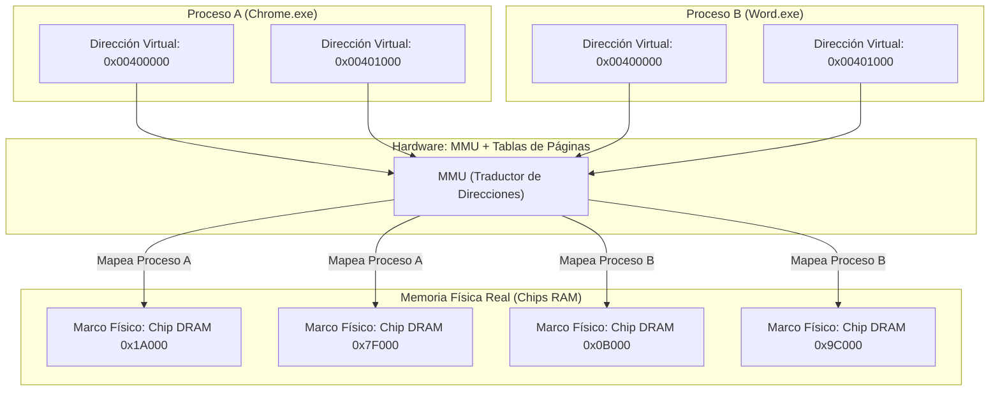

# Manual Teórico de Cátedra: Arquitectura de Memoria Real y Virtual en Windows 11 (Parte 1)
## Laboratorio de Sistemas Operativos (LSO) — 4.º Año
### Tecnicatura en Informática Personal y Profesional (Res. 3828/09)
### Módulo 3: Arquitectura y Administración de Memoria — Clase 1

---

## 🎯 Fundamentación Pedagógica de la Clase
En el primer semestre de la materia exploramos el concepto de **Proceso** (PCB, PIDs, estados, prioridad de CPU e hilos de ejecución con PowerShell) y el impacto de la interfaz gráfica en el rendimiento del sistema (`dwm.exe`). 

Sin embargo, un proceso no puede ejecutarse en el procesador sin un recurso vital: **la memoria**. ¿Cómo hace el Sistema Operativo para que múltiples aplicaciones (un navegador con 20 pestañas, un editor de código, el antivirus y el propio sistema) se ejecuten simultáneamente en una computadora con apenas 8 GB o 16 GB de RAM física sin pisarse unas a otras ni colapsar la máquina?

La respuesta reside en una de las obras maestras de la ingeniería de software y hardware moderno: **la Arquitectura de Memoria Virtual**. En esta primera clase abordaremos los fundamentos teóricos de la jerarquía de memoria, la traducción acelerada por hardware (**MMU**) y el aislamiento del **Espacio de Direcciones Virtuales (VAS)**, concluyendo con una serie de actividades clínicas de inspección sin programación en el Administrador de Tareas de Windows 11.

---

## 1. La Jerarquía de Memorias en la Computación

En cualquier arquitectura de computadoras moderna (modelo Von Neumann mejorado), existe una compensación inevitable entre **velocidad, capacidad y costo**:

```
                  ▲               
                 / \              [ Registros del CPU ]      < 1 ns   (Bytes)
                /   \             [ Caché L1 / L2 / L3 ]     1 - 10 ns (Kilobytes / Megabytes)
               /     \            --------------------------------------------------------
              /       \           [ Memoria RAM Física ]     50 - 100 ns (Gigabytes)
             /         \          ========================================================
            /           \         [ SSD NVMe / SATA ]        0.05 - 0.5 ms (Cientos de GB / Terabytes)
           /             \        [ Disco HDD Mecánico ]     5 - 15 ms     (Terabytes)
          ─────────────────
           VELOCIDAD (Mayor)                           CAPACIDAD (Mayor)
           COSTO X BIT (Mayor)                         LATENCIA (Mayor)
```

### Tabla Comparativa de Tiempos de Acceso
Para dimensionar la diferencia a escala humana, si un ciclo de CPU equivaliera a **1 segundo**:
- **Registros del CPU:** 1 segundo.
- **Caché L1:** 3 segundos.
- **Caché L3:** 40 segundos.
- **Memoria RAM (DDR4/DDR5):** ~4 a 6 minutos.
- **SSD NVMe:** ~3 a 4 días.
- **Disco Rígido Mecánico (HDD):** ~4 a 6 meses.

> [!IMPORTANT]
> **Principio de Diseño:** La memoria RAM física es finita y rápida. El almacenamiento secundario (disco) es inmenso pero millones de veces más lento. El Administrador de Memoria del Sistema Operativo (*Memory Manager*) tiene como misión mantener en la RAM únicamente los datos e instrucciones que el procesador necesita **ahora mismo**, delegando el resto al almacenamiento secundario sin que las aplicaciones lo noten.

---

## 2. El Problema Histórico de la Memoria Real

En los sistemas operativos primigenios (como MS-DOS o versiones tempranas de UNIX en la década de 1970), los programas accedían directamente a la **Memoria Real (Física)**:

```
[ Dirección Física 0x00000000 ] -> Programa Contabilidad
[ Dirección Física 0x00004000 ] -> Programa Ventas
[ Dirección Física 0x00008000 ] -> Sistema Operativo (Kernel)
```

Este esquema de direccionamiento real sufría de tres defectos graves:
1. **Falta de Protección:** Si el "Programa Ventas" contenía un error en un puntero y escribía en `0x00008000`, corrompía la memoria del Sistema Operativo o de otro programa, provocando el reinicio del equipo (*crash* / pantalla azul).
2. **Fragmentación Excesiva:** Si un programa terminaba y dejaba un hueco de 50 MB, y otro programa requería 60 MB contiguos, el nuevo programa no podía cargarse, desperdiciando memoria (*fragmentación externa*).
3. **Límite Físico Rígido:** Si la computadora tenía 640 KB o 4 MB de RAM, era físicamente imposible ejecutar un software que requiriera un byte más que esa capacidad.

---

## 3. La Solución: Memoria Virtual y la Ilusión del Espacio Privado

La **Memoria Virtual** es una técnica que desacopla la memoria que ve una aplicación (sus **direcciones lógicas o virtuales**) de la memoria física real del hardware (sus **direcciones físicas en chips DRAM**).

### El Concepto de "La Ilusión Contigua"
Para cada proceso que se inicia en Windows, el Administrador de Memoria le crea la **ilusión** de que dispone de un espacio de memoria gigantesco, continuo, que comienza desde la dirección `0` y le pertenece en exclusiva:



> [!NOTE]
> **Beneficio de Aislamiento:** Tanto `Chrome.exe` como `Word.exe` pueden tener variables en la dirección lógica virtual `0x00400000`. Sin embargo, gracias al aislamiento del Sistema Operativo, cada una apunta a chips físicos completamente distintos. Es matemáticamente imposible que un proceso modifique la memoria de otro sin autorización explícita del Kernel.

---

## 4. El Rol de la MMU (Memory Management Unit)

La traducción entre la dirección virtual (que genera el código del programa) y la dirección física (que viaja por el bus de datos a la RAM) ocurre a nivel de **hardware** en una unidad integrada en el procesador llamada **MMU (Memory Management Unit)**.

```
[ Instrucción CPU: MOV EAX, [0x00401000] ]
                       │
                       ▼
           [ Dirección Lógica / Virtual ]
                       │
                       ▼
             ┌───────────────────┐
             │    MMU (CPU)      │ <--- Consulta Tablas de Páginas
             └───────────────────┘      creadas por el Kernel de Windows
                       │
                       ▼
           [ Dirección Física en DRAM ]
                       │
                       ▼
             [ Chip RAM: 0x7F41A000 ]
```

* **Velocidad de Traducción:** La MMU traduce millones de direcciones por segundo gracias a una memoria caché interna ultrarrápida llamada **TLB (Translation Lookaside Buffer)**.
* Si una dirección requerida no está en las tablas o el proceso intenta acceder a una zona protegida, la MMU dispara una **interrupción de hardware** al Kernel de Windows.

---

## 5. Espacio de Direcciones Virtuales (VAS): Modo Usuario vs. Modo Kernel

El **Virtual Address Space (VAS)** es el rango total de direcciones de memoria virtual que un proceso puede utilizar.

### Diferencias entre Arquitecturas de 32 bits y 64 bits:
1. **Sistemas de 32 bits ($2^{32}$ bytes):**
   * Espacio total direccionable: **4 GB**.
   * Windows 32-bit dividía el espacio por defecto en:
     * **2 GB inferiores:** Modo Usuario (*User Mode* - privado para la aplicación).
     * **2 GB superiores:** Modo Núcleo (*Kernel Mode* - compartido para controladores y núcleo).
2. **Sistemas de 64 bits ($2^{64}$ bytes teóricos / 48 bits implementados):**
   * En Windows 11 (arquitectura x64), el espacio virtual es descomunal: **128 Terabytes** para cada proceso en modo usuario, y **128 Terabytes** para el núcleo del sistema operativo.

### Diagrama de División de Espacio en Windows x64:
```
+-------------------------------------------------------------+ 0xFFFFFFFFFFFFFFFF
|                                                             |
|           ESPACIO EN MODO NÚCLEO (KERNEL MODE)              | (128 TB)
|           - Drivers del Hardware                            | Solo accesible en
|           - Núcleo de Windows (ntoskrnl.exe)                | Ring 0 (Privilegiado)
|           - Tablas de Paginación del Sistema                |
|                                                             |
+-------------------------------------------------------------+ 0xFFFF800000000000
|                       Zona Inaccesible                      |
+-------------------------------------------------------------+ 0x00007FFFFFFFFFFF
|                                                             |
|           ESPACIO EN MODO USUARIO (USER MODE)               | (128 TB)
|           - Código del programa (.exe)                      |
|           - Librerías dinámicas cargadas (.dll)             | Anillo Ring 3
|           - Pila de ejecución (Stack) y Montículo (Heap)    | Aislado por proceso
|                                                             |
+-------------------------------------------------------------+ 0x0000000000000000
```

> [!CAUTION]
> **Trampa de Seguridad (Ring 3 vs Ring 0):** Si una aplicación de usuario (Chrome, Discord, un juego) intenta leer o escribir directamente en cualquier dirección del espacio de Modo Kernel, el hardware de la CPU genera una excepción inmediata de violación de acceso (*Access Violation Exception*). Windows mata el proceso infractor en el acto para proteger la estabilidad del equipo.

---

## 6. Actividades Prácticas y Clínicas de Cátedra (Clase 1)

> **Modalidad de Trabajo:** Individual o en parejas sobre las terminales con Windows 11 del laboratorio.  
> **Herramienta de Diagnóstico:** Administrador de Tareas nativo de Windows 11 (`Ctrl + Shift + Esc` o `taskmgr.exe`).  
> **Requisito:** No requiere privilegios de administrador ni escritura de código/scripts.

---

### 🧪 Actividad 1: Auditoría de la Jerarquía de Hardware en Vivo
1. Abrí el Administrador de Tareas con la combinación de teclas `Ctrl + Shift + Esc`.
2. Hacé clic en la pestaña lateral **Rendimiento** y seleccioná **CPU**.
3. Observá el panel inferior derecho y registrá los siguientes datos técnicos de tu máquina:
   * **Caché L1:** ___________________
   * **Caché L2:** ___________________
   * **Caché L3:** ___________________
   * **Sockets / Núcleos / Procesadores lógicos:** ___________________
4. Ahora hacé clic en **Memoria** dentro de la pestaña Rendimiento y registrá:
   * **Velocidad de la RAM:** ____________ MHz
   * **Ranuras usadas:** ____________ de ____________
   * **Memoria reservada para el hardware:** ____________ MB / GB
5. **Pregunta de Análisis:** ¿Por qué el tamaño de la caché L1 es de apenas unos pocos Kilobytes mientras que la memoria RAM es de Gigabytes? Explicá la compensación entre velocidad y costo basándote en el Tema 1.

---

### 🧪 Actividad 2: Identificación de Procesos de 32 bits vs. 64 bits y Aislamiento del VAS
1. En el Administrador de Tareas, dirigite a la pestaña **Detalles** (ícono de lista con viñetas).
2. Hacé clic derecho sobre la cabecera de cualquier columna (por ejemplo, sobre *Nombre* o *PID*) y seleccioná **Elegir columnas**.
3. Buscá y tildá las siguientes columnas técnicas:
   * ☑ **Plataforma** (indica si el proceso es de 32 bits o de 64 bits).
   * ☑ **Tamaño de espacio de trabajo** (*Working Set*: memoria física real que ocupa en RAM).
   * ☑ **Memoria confirmada** (*Commit Size*: memoria virtual privada reservada en su VAS).
4. Hacé clic en **Aceptar**.
5. Buscá en la lista al menos un proceso que indique **32 bits** (habitualmente aplicaciones como instaladores, herramientas heredadas o `Steam.exe`) y uno que indique **64 bits** (como `explorer.exe`, `chrome.exe` o `cmd.exe`).
6. Completá la siguiente tabla comparativa:

| Nombre del Proceso | PID | Plataforma (32 o 64 bits) | Tamaño Espacio de Trabajo (RAM) | Límite Máximo Teórico de su VAS |
| :--- | :---: | :---: | :---: | :---: |
| *Ejemplo 32 bits:* | | | | |
| *Ejemplo 64 bits:* | | | | |

7. **Pregunta de Razonamiento:** Si el proceso de 32 bits intentara solicitar 5 GB de memoria para cargar un archivo enorme, ¿qué ocurriría con él? ¿Por qué la arquitectura de 32 bits no puede otorgárselo aunque la computadora física tenga 16 GB de RAM?

---

### 🧪 Actividad 3: Análisis de Casos de Violación de Acceso (*Access Violation*)
Analizá las siguientes dos situaciones técnicas hipotéticas y respondé según la teoría de los Anillos de Protección (Ring 3 vs Ring 0) y el aislamiento de la MMU:

* **Caso A:** Un videojuego desarrollado por un estudiante tiene un error de programación: un puntero descontrolado intenta escribir el número `0` en la dirección de memoria `0xFFFFF80000001000` (ubicada dentro del espacio del Kernel de Windows).  
  * *¿Qué componente de hardware detecta la infracción?*
  * *¿Por qué Windows no permite que la operación continúe?*
  * *¿Qué mensaje de error típico o acción toma el sistema operativo con el videojuego?*

* **Caso B:** Dos navegadores web están abiertos a la vez: Edge y Chrome. Un usuario abre una pestaña de banca electrónica en Edge. En Chrome, un script publicitario malicioso intenta leer la dirección de memoria donde Edge guarda la clave bancaria.  
  * *Basándote en el diagrama del Tema 3, ¿puede Chrome leer físicamente la memoria de Edge de forma directa? Justificá tu respuesta utilizando el concepto de Espacio de Direcciones Virtuales privado y la MMU.*

---

### 🧪 Actividad 4: Desafío de Órdenes de Magnitud a Escala Humana
Tomando como referencia la tabla del **Tema 1** (donde 1 ciclo de CPU equivale a 1 segundo):
1. Si un procesador necesita un dato que está en sus **Registros internos**, espera **1 segundo**.
2. Si el dato no está en los registros ni en la caché y debe ir a buscarlo a la **Memoria RAM física**, debe esperar **5 minutos**.
3. Si la memoria RAM no tiene el dato y debe ir a buscarlo a un **Disco Rígido Mecánico (HDD)**, la espera equivale a **5 meses**.

* **Pregunta de Cierre:** Explicá con tus palabras por qué es tan crucial para el Administrador de Memoria de Windows predecir y mantener en la memoria RAM los datos más utilizados por los programas, en lugar de leerlos continuamente desde el disco rígido.

---

## 7. Glosario Técnico de la Clase 1 (Para Estudio y Apuntes)

* **MMU (Memory Management Unit):** Componente de hardware integrado en el microprocesador responsable de traducir direcciones virtuales a direcciones físicas en tiempo real.
* **TLB (Translation Lookaside Buffer):** Memoria caché de alta velocidad dentro de la MMU que almacena las traducciones recientes de direcciones virtuales a físicas.
* **Virtual Address Space (VAS):** Rango total de memoria virtual que el Sistema Operativo asigna a un proceso. En Windows x64 es de 128 TB para la aplicación y 128 TB para el Kernel.
* **Modo Usuario (Ring 3):** Nivel de privilegio restringido donde se ejecutan las aplicaciones estándar. No tienen acceso directo al hardware ni a la memoria del sistema.
* **Modo Núcleo / Kernel (Ring 0):** Nivel de máxima autoridad del procesador donde operan el núcleo de Windows (`ntoskrnl.exe`) y los controladores de dispositivos.
* **Violación de Acceso (*Access Violation*):** Excepción disparada por la CPU cuando un proceso intenta acceder a una dirección de memoria inexistente o fuera de su nivel de privilegio asignado.
