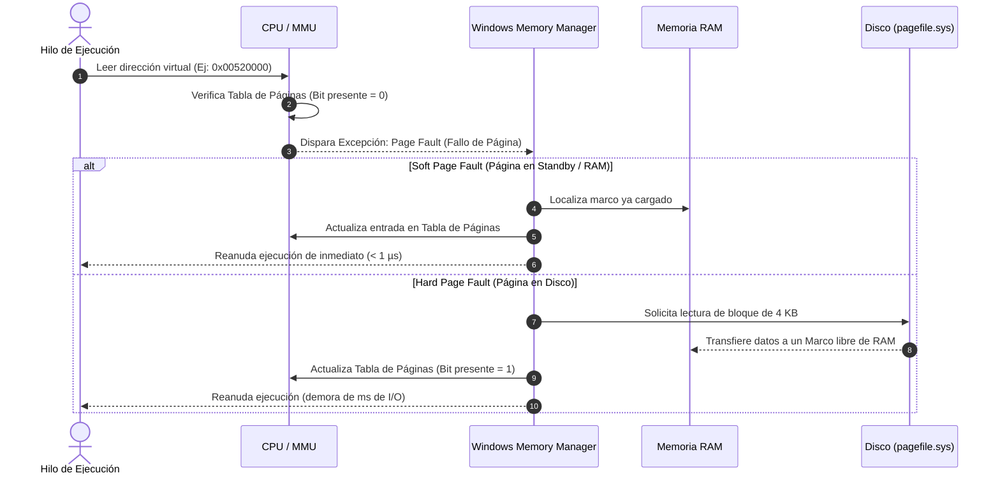

# Manual Teórico de Cátedra: Paginación y Pools de Memoria en Windows 11 (Parte 2)
## Laboratorio de Sistemas Operativos (LSO) — 4.º Año
### Tecnicatura en Informática Personal y Profesional (Res. 3828/09)
### Módulo 3: Arquitectura y Administración de Memoria — Clase 2

---

## 🎯 Introducción a la Segunda Parte
En la Clase 1 analizamos la jerarquía de memorias, la función de la MMU y el aislamiento del Espacio de Direcciones Virtuales (VAS). En esta segunda clase nos adentraremos en el mecanismo operativo que hace posible este funcionamiento continuo: **la paginación a nivel de página física de 4 KB**, la gestión de **fallos de página (*Page Faults*)**, el rol real del archivo de intercambio **`pagefile.sys`**, y la división crítica entre los grupos de memoria del núcleo (**Paged Pool vs Non-Paged Pool**).

---

## 1. Mecanismo de Paginación en Windows: Páginas y Marcos

Windows no administra la memoria byte por byte, porque llevar el registro de miles de millones de bytes individuales saturaría el procesador. En su lugar, fragmenta la memoria en bloques fijos de tamaño estándar llamados **PÁGINAS**:

* **Página Virtual (*Virtual Page*):** Bloque de memoria lógica visto por el programa. En arquitecturas x86 y x64 de Windows, su tamaño estándar es de **4 Kilobytes (4096 bytes)**.
* **Marco de Página (*Page Frame*):** Bloque físico de memoria RAM real de exactamente el mismo tamaño (4 KB).
* **Tabla de Páginas (*Page Table*):** El mapa o índice administrado por el Kernel donde se vincula cada página virtual con su respectivo marco físico en RAM (o con su ubicación en disco si fue paginada).

```
Página Virtual (4 KB)  ────────► [ Tabla de Páginas ] ────────► Marco en RAM (4 KB)
Página #0 (0 a 4095)               Entrada #0: Presente en Marco 412
Página #1 (4096 a 8191)            Entrada #1: Presente en Marco 98
Página #2 (8192 a 12287)           Entrada #2: NO PRESENTE (Está en pagefile.sys)
```

---

## 2. Fallos de Página (*Page Faults*): Suaves vs. Duros

Cuando un hilo de ejecución intenta acceder a una dirección dentro de una página virtual cuya entrada en la Tabla de Páginas marca el bit de presencia en `0` (no está lista en RAM física directa), el hardware del procesador dispara un evento llamado **Page Fault (Fallo de Página)**.

A pesar de su nombre, un fallo de página **no es un error catastrófico ni un cuelgue**; es el mecanismo de control operativo estándar del sistema.

Existen dos tipos radicalmente diferentes:

### A. Fallo de Página Suave (*Soft Page Fault*)
* **¿Qué sucede?:** La página requerida **ya está físicamente en la memoria RAM**, pero no estaba vinculada activamente a la tabla de páginas del proceso.
* **Ejemplos habituales:**
  * Estaba en la lista de páginas en espera (*Standby List* / caché de Windows).
  * Es una página de código compartido (por ejemplo, `ntdll.dll` o `user32.dll`) que otro proceso ya había cargado en RAM.
* **Impacto en Rendimiento:** Prácticamente nulo (microsegundos). Solo requiere que el Administrador de Memoria actualice la entrada en la tabla de páginas.

### B. Fallo de Página Duro (*Hard Page Fault*)
* **¿Qué sucede?:** Los datos solicitados **no existen en la memoria RAM física**. Están almacenados en el disco secundario (en el archivo `pagefile.sys` o en el ejecutable original en disco).
* **Impacto en Rendimiento:** **Extremadamente alto**. El procesador debe suspender temporalmente el hilo de ejecución, emitir una operación de Entrada/Salida (I/O) al disco, esperar a que el controlador del disco lea los 4 KB, cargarlos en un marco libre de RAM y actualizar la tabla.
* **Síntoma Clínico:** La "lentitud" o congelamiento momentáneo cuando una computadora con poca RAM cambia entre ventanas pesadas se debe a ráfagas de miles de *Hard Page Faults* por segundo forzando lectura del disco.



---

## 3. El Archivo de Paginación de Windows (`pagefile.sys`)

En la raíz del disco de sistema (generalmente `C:\pagefile.sys`, oculto con atributos de sistema), reside el archivo donde Windows implementa el **Swapping / Paging**.

### ¿Qué hace exactamente `pagefile.sys`?
Cuando la memoria física RAM comienza a saturarse (o cuando el Administrador de Memoria detecta páginas de datos pertenecientes a procesos que llevan horas inactivos en segundo plano), el Kernel traslada esas páginas modificadas de la RAM al `pagefile.sys`. De este modo, libera marcos de RAM física pura para dárselos a los procesos activos que el usuario está operando en primer plano.

### Mitos Técnicos Frecuentes:
1. *"Si tengo 16 GB o 32 GB de RAM, debo desactivar el archivo de paginación para que la PC vuele":*
   * **FALSO Y PELIGROSO.** El Administrador de Memoria de Windows NT fue diseñado asumiendo la existencia del archivo de paginación. Si se desactiva, Windows no puede vaciar páginas de memoria privada modificadas cuando una aplicación solicita un pico grande de reserva, provocando que los programas se cierren abruptamente con avisos de "Memoria insuficiente" aunque la RAM reporte un 30% libre.
   * Además, sin archivo de paginación, el Kernel no puede generar volcados de memoria (*Crash Dumps*) si ocurre un fallo crítico de pantalla azul (BSOD).
2. *"Todo lo que sale de la RAM va al pagefile.sys":*
   * **FALSO.** El código ejecutable puro (`.exe`, `.dll`) no necesita escribirse en `pagefile.sys`. Como el archivo ya existe en el disco (`C:\Archivos de Programa\...`), el Kernel simplemente descarta la página de la RAM. Si vuelve a necesitarse, la re-lee directamente desde el ejecutable original. Al `pagefile.sys` solo van **páginas modificadas anónimas** (datos creados en memoria que no tienen un archivo original en disco).

---

## 4. Pools de Memoria del Kernel: Paged Pool vs. Non-Paged Pool

Dentro del espacio de Modo Kernel, el Sistema Operativo divide la memoria que consumen los controladores de dispositivos (*drivers*) y las estructuras centrales del sistema en dos grandes grupos:

### A. Non-Paged Pool (Grupo no paginado)
* **Definición:** Memoria física garantizada que **JAMÁS, bajo ninguna circunstancia, puede ser movida al disco ni sufrir paginación**.
* **¿Por qué existe?:** Ciertas partes del Kernel manejan interrupciones críticas del hardware (ISRs) o búferes de red en tiempo real. Si el hardware de red recibe un paquete y el procesador intenta procesarlo pero la rutina del driver estuviera en el disco (`pagefile.sys`), la CPU se bloquearía a sí misma esperando el disco, provocando un colapso irreversible del sistema.
* **Componentes típicos:** Búferes de paquetes de red, manejadores de interrupción del teclado/disco, tablas de páginas maestras.

### B. Paged Pool (Grupo paginado)
* **Definición:** Bloques de memoria del Kernel que sí pueden trasladarse al `pagefile.sys` cuando la memoria física escasea.
* **Componentes típicos:** Estructuras internas de ventanas del usuario, colas de impresión, cachés de controladores que no atienden interrupciones críticas.

| Característica | Non-Paged Pool (No Paginado) | Paged Pool (Paginado) |
| :--- | :--- | :--- |
| **Ubicación Permitida** | Exclusivamente en RAM Física | RAM Física o en `pagefile.sys` |
| **Crítico ante Interrupciones** | Sí (Ring 0 de alta prioridad) | No |
| **Peligro Técnico** | Fugas de memoria (*leaks*) aquí colapsan la RAM y no pueden liberarse con swap | Si crece, satura el disco por paginación |

---

## 5. Glosario Técnico de Cátedra (Para Estudio y Apuntes de la Parte 2)

* **MMU (Memory Management Unit):** Componente de hardware integrado en el procesador responsable de traducir direcciones virtuales a direcciones físicas en tiempo real.
* **Virtual Address Space (VAS):** Rango de direcciones lógicas asignado a un proceso por el Sistema Operativo. En Windows x64 es de 128 TB en espacio de usuario.
* **Página (Virtual Page):** Bloque estándar de memoria virtual de 4 KB en sistemas x86/x64.
* **Marco de Página (Page Frame):** Bloque físico de 4 KB en los chips de memoria RAM.
* **Page Table (Tabla de Páginas):** Estructura jerárquica del Kernel que mantiene la correspondencia entre páginas virtuales y marcos físicos.
* **Soft Page Fault:** Fallo de página resuelto sin acceso a disco; la página ya residía en memoria RAM.
* **Hard Page Fault:** Fallo de página que obliga al sistema a suspender el hilo y realizar una lectura I/O lenta al almacenamiento secundario.
* **Commit Charge / Límite de Compromiso:** Cantidad total de memoria virtual garantizada que los programas han reservado y para la cual el Sistema Operativo debe prometer espacio (suma de RAM física + espacio disponible en `pagefile.sys`).
* **Non-Paged Pool:** Sección de memoria del Kernel de Windows que nunca puede ser enviada al disco.
